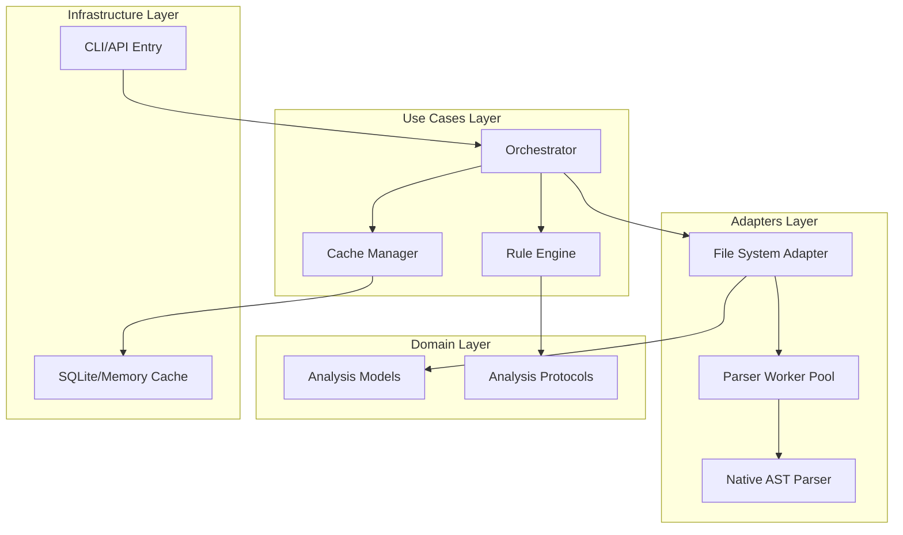

# Design Document: High-Performance AST Parsing Engine


## Overview


The High-Performance AST Parsing Engine (F0a) is designed with a 'Scan-Once, Check-Many' philosophy. The strategy centers on maximizing CPU utilization through a multi-process worker pool that executes a single-pass AST traversal for every file. By implementing the Visitor pattern in the Rule Engine, we decouple the multidimensional analysis (PEP8, logic, security) from the parsing logic, allowing diverse checks to run simultaneously against the same AST in-memory structure. 

The design introduces a sophisticated incremental processing layer that utilizes SHA-256 file hashing. This ensures that in a CI/CD environment, only files that have actually changed are re-parsed, while results for unchanged files are served from a persistent local cache. This approach minimizes Developer Idle Time even as the codebase grows. The existing CLI interface remains the entry point, but the underlying execution moves from sequential processing to an asynchronous, parallel-worker architecture.

Significant changes occur in the 'adapters' and 'usecases' layers to accommodate native Python `ast` interactions and the new Orchestrator. The domain models are refined to include precise byte-offset metadata for IDE-like highlighting in the terminal. No changes are required for existing output formatters, which will continue to consume the aggregated analysis reports.


## Architecture





## Components and Interfaces


### 1. Parallel Analysis Orchestrator (`usecases`)


**Path:** `src/usecases/orchestrator.py`

| Responsibility | Description |
|---|---|
| Manage multiprocess worker pool for CPU-bound AST parsing | |
| Coordinate between CacheManager and RuleEngine | |
| Aggregate partial results into a unified report | |


```python
class AnalysisOrchestrator:
    async def run_parallel_analysis(
        self, 
        paths: List[Path], 
        rules: List[Rule]
    ) -> AnalysisReport:
        # Implementation of worker distribution
        pass
```


### 2. Multidimensional Rule Engine (`usecases`)


**Path:** `src/usecases/rule_engine.py`

| Responsibility | Description |
|---|---|
| Execute PEP8, Security, and Logic checks via AST traversal | |
| Map AST nodes to physical source code locations | |
| Filter violations based on configuration severity | |


```python
class RuleEvaluator(ast.NodeVisitor):
    def __init__(self, check_groups: List[BaseCheck]):
        self.violations = []

    def visit_FunctionDef(self, node: ast.FunctionDef):
        for check in self.check_groups:
            if result := check.verify(node):
                self.violations.append(result)
        self.generic_visit(node)
```


### 3. AST Provider & Metadata Extractor (`adapters`)


**Path:** `src/adapters/ast_provider.py`

| Responsibility | Description |
|---|---|
| Convert source strings to AST representations | |
| Extract exact byte-offsets for terminal highlighting | |
| Handle file-system read operations and encoding detection | |


```python
class ASTProvider:
    def parse_source(self, source_code: str) -> ast.Module:
        return ast.parse(source_code, type_comments=True)

    def get_node_metadata(self, node: ast.AST) -> NodeLocation:
        return NodeLocation(
            line=node.lineno,
            col=node.col_offset,
            end_line=getattr(node, 'end_lineno', node.lineno)
        )
```


### 4. Incremental Cache Manager (`infrastructure`)


**Path:** `src/infrastructure/cache_manager.py`

| Responsibility | Description |
|---|---|
| Track file modifications using SHA-256 hashes | |
| Persist analysis results to disk for cross-run speedups | |
| Ensure cache consistency during interrupted runs | |


```python
class CacheManager:
    def get_cached_result(self, file_path: Path) -> Optional[StoredAnalysis]:
        # Check hash and return cached violations if valid
        pass
    
    def update_cache(self, file_path: Path, results: List[Violation]):
        pass
```


## Data Models


No new data models are introduced unless specified in the component descriptions above.


## Correctness Properties


*A property is a characteristic or behavior that should hold true across all valid executions of a system — essentially, a formal statement about what the system should do.*


### Property F0a-P1: Cache Integrity Invariant


*For any file F, if the SHA-256 hash of F remains unchanged since the last execution, the Orchestrator shall return the cached analysis results for F without invoking the AST Provider.*

**Validates: Requirements E8, E7**


### Property F0a-P2: Metadata Accuracy Invariant


*For any reported violation V, the metadata (line, column) provided by the AST Provider must correspond to the exact character offset of the offending node in the original source code.*

**Validates: Requirements E16, E5, E13**


### Property F0a-P3: Parallel Scalability Invariant


*For any analysis run on N files, the total execution time must scale as O(N/P) where P is the number of available CPU cores, excluding I/O bound wait times.*

**Validates: Requirements E8, E7**


## Error Handling


| Scenario | Handling |
|---|---|
| Corrupt or Non-UTF8 Python file encountered during scan | The error is caught at the adapter level, a 'ParsingViolation' is generated for the specific file, and the Orchestrator continues processing remaining files in the queue. |
| Rule-specific logic crashes on an unexpected AST node structure | The Rule Engine uses a safety wrapper to catch exceptions in individual check logic, logging the failure but allowing other rules (PEP8, security) to finish execution. |
| Incompatible cache version or corrupted SQLite metadata store | The Cache Manager invalidates the local cache file and proceeds with a full fresh scan of the codebase. |


## Testing Strategy


The testing strategy for the AST Engine combines traditional unit testing with performance-focused integration tests. Regression testing will utilize the existing suite of PEP8 and security test cases, ensuring that the move to a parallel architecture does not introduce race conditions or non-deterministic violation reports. CI verification will be automated via a dedicated workflow executing `pytest` with the `pytest-xdist` plugin to simulate multi-core environments.

New property-based tests using the 'Hypothesis' library will be implemented to verify the Metadata Accuracy Invariant. These tests will generate random Python snippets with known violations and assert that the extracted AST coordinates match the generation parameters. For configuration, we will use a 'performance' tag in our test suite to separate long-running scalability checks from the standard test run. Performance benchmarks will target 1,000+ files per second on standard 8-core hardware, with a specific focus on cache hit/miss ratio verification.
