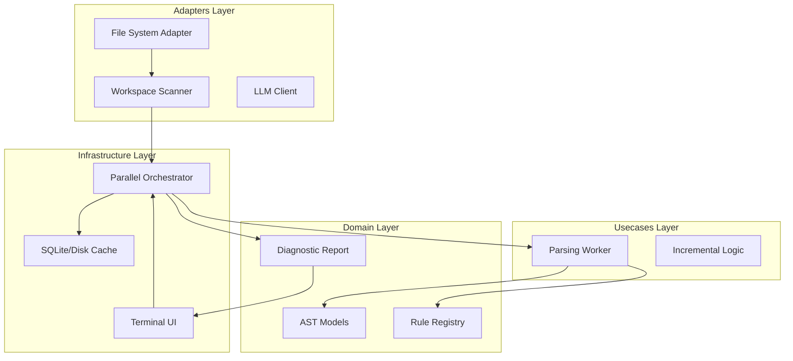

# Design Document: High-Performance AST Parsing Engine


## Overview


The F0a engine design adopts a 'Speed-First, Fidelity-Always' philosophy. The strategy is to decouple the heavy AST parsing and rule evaluation from the user interface using a parallelised worker pool. Central to this approach is the 'Incremental Manifest'—a local database that tracks file hashes to ensure that we only parse what has changed. This allows the tool to maintain sub-second response times even as the project grows to thousands of files.

Architecturally, we are moving from a single-threaded sequential linter to a multi-process architecture. While we keep the core Python `ast` module (or a high-fidelity wrapper like `libcst`), we wrap it in a custom visitor logic that captures exact byte-offsets for UI highlighting. The infrastructure is designed to be 'stateless' regarding the code, relying entirely on the local file system and a lightweight sidecar cache database.


## Architecture





## Components and Interfaces


### 1. Parallel Orchestrator (`usecases`)


**Path:** `src/usecases/orchestrator.py`

| Responsibility | Description |
|---|---|
| Managing process pool for parallel execution | |
| Interfacing with Incremental Logic to skip unchanged files | |
| Aggregating diagnostics from multiple workers | |
| Providing progress updates to the UI layer | |


```python
class Orchestrator:
    async def lint_workspace(self, root_dir: Path) -> List[Diagnostic]:
        tasks = await self.incremental_engine.filter_changed(root_dir)
        async with ProcessPoolExecutor() as executor:
            results = await asyncio.gather(*[
                executor.submit(self.worker.process_file, t) 
                for t in tasks
            ])
        return self.aggregator.flatten(results)
```


### 2. High-Fidelity Parsing Worker (`usecases`)


**Path:** `src/usecases/worker.py`

| Responsibility | Description |
|---|---|
| Generating high-fidelity ASTs from Python source | |
| Applying security and logic rules (E3/E6) | |
| Mapping nodes to absolute file positions (E16) | |
| Extracting code snippets for UI highlighting | |


```python
class ParsingWorker:
    def process_file(self, content: str, path: Path) -> List[Diagnostic]:
        tree = self.parser.parse(content)
        diagnostics = []
        for rule in self.registry.get_active_rules():
            issues = rule.check(tree)
            diagnostics.extend([
                Diagnostic(issue, source_map=tree.get_map(issue.node)) 
                for issue in issues
            ])
        return diagnostics
```


### 3. Incremental State Manager (`infrastructure`)


**Path:** `src/infrastructure/cache.py`

| Responsibility | Description |
|---|---|
| Calculating fast content hashes (BLAKE3) | |
| Maintaining a local database of linting state | |
| Identifying modified files for incremental processing | |


```python
class StateManager:
    def get_diff(self, files: List[Path]) -> List[Path]:
        current_hashes = {f: self.hash(f) for f in files}
        stored = self.db.query_all_hashes()
        return [f for f, h in current_hashes.items() if h != stored.get(f)]

    def persist_results(self, file: Path, diagnostics: List[Diagnostic]):
        self.db.upsert(file, self.hash(file), diagnostics)
```


### 4. High-Fidelity Result Renderer (`adapters`)


**Path:** `src/adapters/terminal_ui.py`

| Responsibility | Description |
|---|---|
| Visualizing diagnostics with color and highlighting (E16) | |
| Rendering code context panels (E20) | |
| Formatting output for terminal-specific constraints | |


```python
class ResultRenderer:
    def render(self, diagnostics: List[Diagnostic]):
        console = Console()
        for diag in diagnostics:
            syntax = Syntax(
                diag.code_snippet, 
                "python", 
                line_numbers=True,
                highlight_lines={diag.line}
            )
            console.print(Panel(syntax, title=f"[red]{diag.rule_id}"))
```


## Data Models


No new data models are introduced unless specified in the component descriptions above.


## Correctness Properties


*A property is a characteristic or behavior that should hold true across all valid executions of a system — essentially, a formal statement about what the system should do.*


### Property F0a-P1: Incremental Consistency


*For any file F with content C, if hash(C) is unchanged since the last execution, the set of Diagnostics returned for F must be identical to the previous execution.*

**Validates: Requirements E8**


### Property F0a-P2: Mapping Fidelity


*For any Diagnostic D pointing to line L and column K, the rendered snippet in the UI must contain the exact character at position (L, K) from the source file.*

**Validates: Requirements E16, E20**


### Property F0a-P3: Detection Completeness


*For any source file F containing a known vulnerability pattern V defined in the Registry, the Parsing Worker must generate at least one Diagnostic D targeting the coordinates of V.*

**Validates: Requirements E1, E3, E6**


## Error Handling


| Scenario | Handling |
|---|---|
| Invalid Python syntax in one of the scanned files. | Catch SyntaxError, generate a special 'ParseFailure' Diagnostic with the line number from the exception, and continue processing remaining files. |
| ProcessPoolExecutor encounters a worker crash or SIGINT. | Flush and close the cache database to prevent corruption, then exit with a non-zero code. |
| Terminal doesn't support Rich/Color formatting. | Fall back to standard colorless text output but maintain alignment and line numbering. |


## Testing Strategy


The testing strategy focuses on high-concurrency stress tests and property-based verification of AST mapping. 

Regression Testing: We will use a 'Golden Master' approach where we run the linter on popular open-source repositories (e.g., Django, Flask) and verify that the number of detected issues remains constant across refactors of the orchestrator.

CI Verification: The CI pipeline will execute `pytest -n auto` to test the parallel orchestrator's stability. We will also use `hypothesis` to generate random Python syntaxes to ensure the parser never crashes (fuzzing).

Property-Based Tests: Using the Hypothesis library, we will assert that 'For any randomized code change, the Incremental Engine correctly identifies the file as dirty'. We will run 1000 iterations per PR.

Configuration: Tests will be tagged with `@pytest.mark.performance` for the benchmarking suite. We use `pytest-benchmark` to ensure no regression in parsing speed (threshold: <50ms/file).
