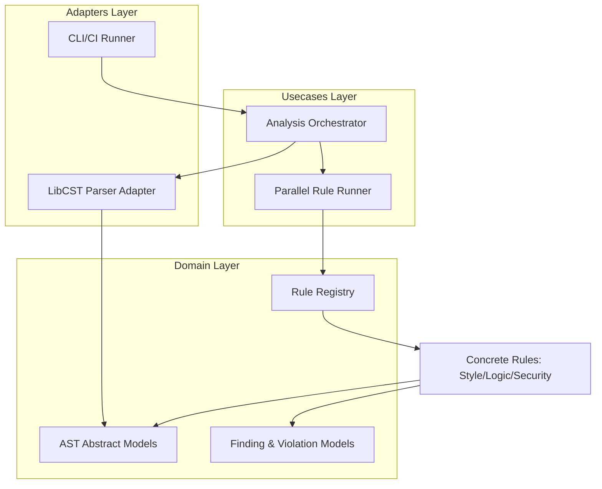

# Design Document: Rules Engine & Parser


## Overview


The Rules Engine & Parser (F0a) is designed with a core philosophy of 'Concurrent Fidelity.' To satisfy the demand for high-speed CI/CD without sacrificing analysis depth, we employ a multi-layered approach: a high-fidelity LibCST-based parser for AST generation and a multi-process execution engine for rule application. The system transitions from sequential, single-domain linting to a unified, parallelized analysis framework that handles style, security, and logic in a single pass.

The strategy focuses on an incremental roll-out of the 'Parallel Rule Runner' use case, which leverages Python's multiprocessing capabilities to bypass the Global Interpreter Lock (GIL) during CPU-bound AST traversals. While the parsing logic remains centralized in the 'Adapters' layer, the execution is distributed. The 'Rule Registry' acts as the domain bridge, consolidating disparate check types into a common interface, thus eliminating the need for multiple fragmented tools in the developer's workflow.


## Architecture





## Components and Interfaces


### 1. Rule Registry (`domain`)


**Path:** `src/domain/rules/registry.py`

| Responsibility | Description |
|---|---|
| Centralize all style, logic, and security rules | |
| Provide filtering mechanisms for CI/CD quality gates | |
| Maintain metadata for rule execution optimization | |


```python
class Rule(Protocol):
    id: str
    category: RuleCategory
    severity: Severity

    def evaluate(self, node: cst.CSTNode) -> List[Violation]:
        ...

class RuleRegistry:
    def register(self, rule: Rule) -> None: ...
    def get_rules(self, categories: Set[RuleCategory]) -> List[Rule]: ...
```


### 2. Parallel Rule Runner (`usecases`)


**Path:** `src/usecases/engine/runner.py`

| Responsibility | Description |
|---|---|
| Execute rules across multiple CPU cores | |
| Manage worker process lifecycle and inter-process communication | |
| Aggregate findings from parallel execution streams | |


```python
class ParallelRunner:
    def __init__(self, max_workers: int = None):
        self.executor = ProcessPoolExecutor(max_workers=max_workers)

    async def run_analyze(self, 
        files: List[Path], 
        rules: List[Rule]
    ) -> List[AnalysisResult]:
        # Implementation using concurrent.futures or multiprocessing
        ...
```


### 3. AST Source Parser (`adapters`)


**Path:** `src/adapters/parser/libcst_adapter.py`

| Responsibility | Description |
|---|---|
| Convert Python source code into LibCST modules | |
| Handle syntax errors during the parsing phase | |
| Provide a consistent interface for the analysis orchestrator | |


```python
class ParserAdapter:
    def parse_source(self, source_code: str) -> cst.Module:
        try:
            return libcst.parse_module(source_code)
        except libcst.ParserSyntaxError as e:
            raise SourceParsingException(e) from e
```


## Data Models


No new data models are introduced unless specified in the component descriptions above.


## Correctness Properties


*A property is a characteristic or behavior that should hold true across all valid executions of a system — essentially, a formal statement about what the system should do.*


### Property F0a-P1: Security Violation Invariant


*For any Python source file containing a CRITICAL security vulnerability defined in the registry, the ParallelRunner must return at least one Violation with Severity.CRITICAL.*

**Validates: Requirements 4**


### Property F0a-P2: Parallel Efficiency Bound


*For any set of N independent source files, the execution time T(N) shall be less than 1.5 * (T_parse + T_rules_max) where T_rules_max is the duration of the longest-running rule on a single core.*

**Validates: Requirements 2**


### Property F0a-P3: Parse Fidelity Invariant


*For any input source file, the AST Parser Adapter must produce a structure that, when serialized, is character-equivalent to the original source.*

**Validates: Requirements 1**


## Error Handling


| Scenario | Handling |
|---|---|
| Invalid Python Syntax in source file | Record as a 'SkippedFile' result with the associated error message; do not stop the engine. |
| Rule execution exceeds timeout or raises Exception | Isolate the failure to the specific worker; retry once, then mark the specific rule/file pair as 'Failed' and continue other rules. |
| Configuration defines a non-existent Rule ID or Domain | Validate configuration early; exit with code 1 and a descriptive message before starting workers. |


## Testing Strategy


The testing strategy employs a 'py-test' based suite with a heavy emphasis on property-based testing using 'Hypothesis' to ensure the parser handles edge-case Python syntaxes. 

1. Regression Testing: We will reuse the existing Python test suite by running the new engine against known 'clean' and 'dirty' codebases, asserting that parity is maintained with legacy output.
2. Property-Based Testing: Rules will be tested by generating arbitrary AST nodes and verifying that the engine neither crashes nor produces false positives for benign code. We will use the '@hypothesis.given' decorator with custom 'libcst' node strategies.
3. CI Verification: Performance benchmarks will be integrated into the CI pipeline. A 'perf_gate' task will run the engine on a 100k LOC repository; if execution exceeds 60 seconds on a standard 4-core runner, the build will fail.
4. Concurrency Testing: Stress tests will be conducted using 1, 2, 4, and 8 worker configurations to verify thread safety and absence of race conditions in result aggregation. Configuration will use the 'pytest-xdist' plugin for parallel test execution.
