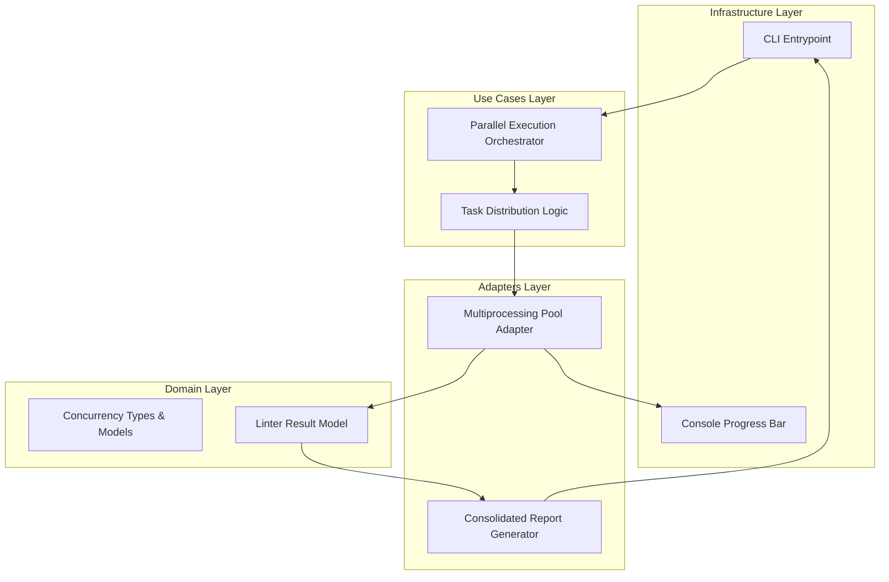

# Design Document: Concurrent Analysis Worker Hub


## Overview


The Concurrent Analysis Worker Hub transitions the linter from a sequential execution model to a high-performance multiprocessing architecture. The core strategy utilizes a 'Master-Worker' pattern where the main process focuses on orchestration, progress reporting, and result aggregation, while independent worker processes handle the CPU-intensive code analysis. This approach directly addresses CI bottlenecks by saturating available CPU cores, especially in 'mega-repos'.

The design prioritizes isolation and immutability; tasks are dispatched as read-only payloads, and results are returned via inter-process communication (IPC) as serialized data structures. While the internal execution engine changes significantly, the domain logic for linting remains identical to ensure consistency between local single-file runs and bulk CI scans. We use a dynamic chunking algorithm to ensure load balancing across cores, preventing the 'long-tail' problem where one slow task stalls the entire pipeline.


## Architecture





## Components and Interfaces


### 1. Parallel Execution Orchestrator (`usecases`)


**Path:** `src/usecases/parallel_orchestrator.py`

| Responsibility | Description |
|---|---|
| Initializing the Multiprocessing Pool based on hardware availability | |
| Partitioning the task queue for optimal load balancing | |
| Supervising worker health and resource consumption | |
| Aggregating partial results into a final consolidated state | |


```python
class ParallelOrchestrator:
    def __init__(self, worker_count: int, reporter: IProgressReporter):
        self.worker_count = worker_count
        self.reporter = reporter

    async def execute_parallel(self, tasks: List[AnalysisTask]) -> List[AnalysisResult]:
        # Implementation of process pool management
        pass
```


### 2. Multiprocessing Pool Adapter (`adapters`)


**Path:** `src/adapters/concurrency/mp_pool_adapter.py`

| Responsibility | Description |
|---|---|
| Mapping high-level tasks to low-level process fork/spawn calls恢复 | |
| Managing IPC for progress updates and result gathering | |
| Handling OS-specific signal propagation (e.g., SIGINT) | |


```python
class WorkerPoolAdapter(IWorkerPool):
    def run_map_async(self, func: Callable, items: Iterable) -> AsyncIterator[Result]:
        with Pool(processes=self.cpu_count) as pool:
            for result in pool.imap_unordered(func, items):
                yield result
```


### 3. Progress Tracking Monitor (`infrastructure`)


**Path:** `src/infrastructure/progress_monitor.py`

| Responsibility | Description |
|---|---|
| Rendering real-time progress bars to the console | |
| Providing visual feedback on throughput (tasks/sec) | |
| Integrating with the Orchestrator for task lifecycle events恢复 | |


```python
class ProgressMonitor:
    def update(self, completed: int, total: int):
        # UI logic for real-time bar rendering
        pass
```


## Data Models


No new data models are introduced unless specified in the component descriptions above.


## Correctness Properties


*A property is a characteristic or behavior that should hold true across all valid executions of a system — essentially, a formal statement about what the system should do.*


### Property F0b-P1: Deterministic Result Aggregation


*For any set of input files T, the union of results from all parallel workers W must be equal to the results generated by a single-threaded execution S on the same set T.*

**Validates: Requirements 3**


### Property F0b-P2: CPU Core Boundary Constraint


*For any execution on a machine with N physical cores, the number of child processes spawned must not exceed N + 1 (primary process).*

**Validates: Requirements 1, 2**


### Property F0b-P3: Total Task Completion Invariant产


*For any task list L, the Progress Monitor must receive exactly |L| completion signals before the Orchestrator terminates.*

**Validates: Requirements 4**


## Error Handling


| Scenario | Handling |
|---|---|
| A worker process encounters an unhandled exception or crash during file analysis. | The Orchestrator captures the exception, logs the worker ID and the file being processed, and continues with remaining tasks to ensure a single file doesn't crash the entire CI run. |
| The user issues a keyboard interrupt (SIGINT) during a large-scale parallel scan. | The Pool Adapter implements a timeout mechanism and sends a SIGTERM to all child processes, followed by a cleanup of IPC resources. |
| Imbalanced task distribution (e.g., one huge file and 100 tiny files). | The distributor uses a 'chunking' strategy based on file size rather than just file count to prevent uneven distribution where one core works significantly longer than others. |


## Testing Strategy


Our testing strategy focuses on both performance scaling and data integrity across process boundaries. 

Regression testing will involve running the existing test suite under a forced concurrency level of 1, 2, and 4 workers to ensure that the parallel infrastructure doesn't introduce race conditions in result collection. CI verification will be handled via a GitHub Action matrix that tests the linter on varying runner types (2-core vs 8-core) to verify core detection and utilization using `pytest-xdist`.

New property-based tests using 'Hypothesis' will be implemented to generate arbitrary lists of 'dummy files' with varying sizes. We will assert that for any generated project structure, the total count of detected errors in parallel mode exactly matches a reference serial run. We will use `pytest` with a 100-iteration setting for these property tests, tagged with `@pytest.mark.concurrency` to separate them from fast unit tests.
