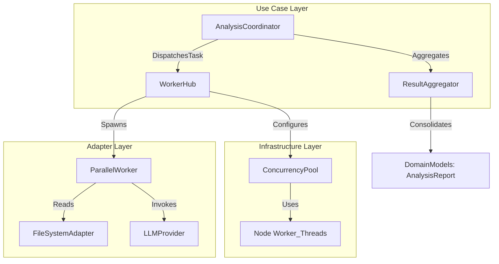

# Design Document: Concurrent Analysis Worker Hub


## Overview


The Concurrent Analysis Worker Hub adopts a 'Master-Worker' architectural pattern to address the scalability requirements of large-scale codebases. The core strategy involves partitioning the file scan list into discrete task units that are distributed across a pool of Node.js worker threads. This approach ensures that we leverage multi-core hardware without the overhead of full process forking, while maintaining a shared-nothing memory architecture within workers to prevent race conditions during the analysis phase.

The transition to concurrent processing is managed incrementally: the existing single-threaded analysis engine is encapsulated into a 'WorkerTask' unit, allowing the underlying linting logic to remain unchanged while the orchestration layer handles the parallel distribution. The ResultAggregator then performs a thread-safe reduction of individual worker outputs into a single unified report. This philosophy prioritizes 'Correctness over Performance,' ensuring that parallelizing the work never changes the linting outcome compared to a sequential run.


## Architecture





## Components and Interfaces


### 1. AnalysisCoordinator (`usecases`)


**Path:** `src/usecases/analysis_coordinator.ts`

| Responsibility | Description |
|---|---|
| Partition file lists for distribution | |
| Manage lifecycle of worker execution | |
| Trigger result aggregation upon completion | |


```python
export interface ICoordinator {
  executeParallel(files: string[]): Promise<AnalysisReport>;
}

class AnalysisCoordinator implements ICoordinator {
  constructor(
    private hub: IWorkerHub,
    private aggregator: IResultAggregator
  ) {}
}
```


### 2. WorkerHub (`adapters`)


**Path:** `src/adapters/worker_hub.ts`

| Responsibility | Description |
|---|---|
| Initialize worker thread pool | |
| Load-balance tasks across cores | |
| Handle container-specific CPU limits (cgroups) | |


```python
export interface IWorkerHub {
  dispatch(batch: AnalysisTask[]): Promise<AnalysisResult[]>;
  getCapacity(): number;
}

export type AnalysisTask = {
  filePath: string;
  config: LinterConfig;
};
```


### 3. ResultAggregator (`usecases`)


**Path:** `src/usecases/result_aggregator.ts`

| Responsibility | Description |
|---|---|
| Merge partial results into a global state | |
| Deduplicate findings across concurrent batches | |
| Calculate final performance metrics (files/sec) | |


```python
export class ResultAggregator {
  private state: Map<string, Counter>;

  addBatch(results: AnalysisResult[]): void {
    results.forEach(res => this.merge(res));
  }

  getFinalReport(): AnalysisSummary {
    return {
      totalErrors: this.total('error'),
      filesProcessed: this.state.size
    };
  }
}
```


## Data Models


No new data models are introduced unless specified in the component descriptions above.


## Correctness Properties


*A property is a characteristic or behavior that should hold true across all valid executions of a system — essentially, a formal statement about what the system should do.*


### Property F0b-P1: Result Consistency Invariant


*For any set of input files S, the union of results from N workers must equal the result of a single-threaded execution on S.*

**Validates: Requirements 2.0**


### Property F0b-P2: Resource Bounds Invariant


*For any execution environment, the number of active worker threads T must satisfy 1 <= T <= max(1, allocated_cpu_cores).*

**Validates: Requirements 1.0, 3.0**


### Property F0b-P3: Partial Failure Tolerance


*For any individual file F failing analysis in Worker W, the global report must include the error status for F regardless of other worker successes.*

**Validates: Requirements 2.0**


## Error Handling


| Scenario | Handling |
|---|---|
| Worker thread crashes due to OOM on a specific large file | The WorkerHub catches the exit code. The specific file that caused the crash is flagged as 'failed' in the aggregator, and the worker is restarted to process the remaining queue. |
| LLM API rate limit hit by multiple concurrent workers | The AnalysisCoordinator uses a retry logic with exponential backoff per-worker. If max retries are exceeded, the specific task is marked as 'Incomplete' in the final report summary. |


## Testing Strategy


The testing strategy focuses on high-concurrency stress tests and consistency checks. 

Regression Testing: We will run existing 'Large Project' test suites in both --single-thread and --parallel modes, asserting that the JSON output files are identical.

CI Verification: Integration tests will be executed on runners with varying core counts (e.g., 2-core vs 16-core) using `npm run test:concurrency`. We will use `taskset` or Docker CPU limits to verify the hub's ability to detect and respect resource constraints.

Property-Based Testing: Using `fast-check`, we will generate random sets of file analysis results and verify that the `ResultAggregator.merge()` operation is commutative and associative. This ensures that the order in which workers finish never affects the final count.

Configuration: Testing will utilize the `WorkerThread` mocking library to simulate high-latency workers. We will perform 100 iterations per property test with a 'max-parallel' tag to catch race conditions in the aggregator.
