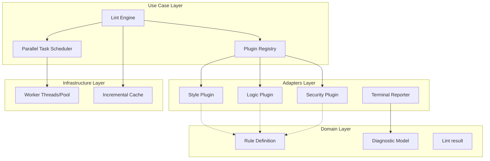

# Design Document: Modular Linting Plugin Architecture


## Overview


The Modular Linting Plugin Architecture adopts a 'Parallel-First' philosophy, moving away from sequential rule processing to a distributed execution model. By decoupling rule definitions into distinct categories (Style, Logic, Security), we enable fine-grained quality gates where a security violation might break a build, while style warnings are relegated to non-blocking diagnostics. The core engine is refactored to treat every linting rule as an independent unit of work that can be offloaded to worker threads.

To support aesthetics-driven development, the reporting layer is completely overhauled to consume a new 'Rich Diagnostic' interface. This interface mandates positional data (offsets and ranges), enabling the terminal reporter to generate syntax-highlighted snippets similar to modern compilers. The incremental execution strategy is implemented at the engine level, using content hashing to skip unnecessary computations, thereby significantly reducing developer feedback cycles in large monorepos.


## Architecture





## Components and Interfaces


### 1. Parallel Lint Engine (`usecases`)


**Path:** `src/core/engine.ts`

| Responsibility | Description |
|---|---|
| Orchestrate plugin execution flow | |
| Manage incremental execution cache state | |
| Aggregate diagnostics from parallel workers | |
| Enforce quality gate categories | |


```python
interface ILintEngine {
  registerPlugin(plugin: ILintPlugin): void;
  execute(files: string[]): Promise<LintReport>;
}

interface ILintPlugin {
  metadata: {
    id: string;
    category: 'Style' | 'Logic' | 'Security';
  };
  run(context: LintContext): Promise<Diagnostic[]>;
}
```


### 2. Rich Diagnostic Reporter (`adapters`)


**Path:** `src/adapters/reporters/terminal_reporter.ts`

| Responsibility | Description |
|---|---|
| Format raw diagnostic data for terminal display | |
| Apply syntax highlighting to code snippets within reports | |
| Group errors by category for quick triage | |


```python
interface Diagnostic {
  code: string;
  message: string;
  severity: Severity;
  range: { start: Position; end: Position };
  relatedInformation?: Location[];
  category: RuleCategory;
}

class TerminalReporter implements IReporter {
  render(diagnostics: Diagnostic[]): void;
}
```


### 3. Parallel Task Scheduler (`infrastructure`)


**Path:** `src/infrastructure/scheduler.ts`

| Responsibility | Description |
|---|---|
| Manage worker thread lifecycle | |
| Distribute linting tasks across available CPU cores | |
| Handle worker-level error isolation | |


```python
export class ParallelScheduler {
  private pool: WorkerPool;
  
  async scheduleTasks<T>(tasks: Array<() => Promise<T>>): Promise<T[]> {
    return Promise.all(tasks.map(t => this.pool.run(t)));
  }
}
```


## Data Models


No new data models are introduced unless specified in the component descriptions above.


## Correctness Properties


*A property is a characteristic or behavior that should hold true across all valid executions of a system — essentially, a formal statement about what the system should do.*


### Property F0b-P1: Mandatory Categorization


*For any linting execution, the resulting diagnostics must be tagged with a category belonging to {Style, Logic, Security}.*

**Validates: Requirements E3, E6, E7**


### Property F0b-P2: Incremental Performance Bound


*For any file with a constant hash and unchanged plugin version, the execution time of the second linting pass must be less than 10% of the first pass execution time.*

**Validates: Requirements E8**


### Property F0b-P3: Diagnostic Fidelity


*For any diagnostic reported, the data structure must contain exact line and column ranges corresponding to the source document.*

**Validates: Requirements E18, E20, E13, E16**


## Error Handling


| Scenario | Handling |
|---|---|
| A plugin throws an unhandled exception during parallel execution. | The offending plugin is isolated, its error is logged to the diagnostic stream as a 'System Error' category, and other plugins continue to execute. |
| A plugin returns diagnostic ranges that exceed the file length. | The Diagnostic Reporter ignores invalid ranges and defaults to file-level reporting, preventing a UI crash. |
| Incremental cache corruption or version mismatch. | The engine clears the local cache for that file and performs a full re-scan. |


## Testing Strategy


The testing strategy centers on 'Property-Based Testing' (using fast-check) to ensure the parallel scheduler handles race conditions and worker failures gracefully. We will generate thousands of random 'Rule' outputs to verify that the 'Terminal Reporter' can handle various edge cases in source code ranges without crashing.

Regression testing will involve running the new engine against the existing rule-set to ensure that diagnostic counts remain identical to the legacy sequential engine. CI verification will be automated via GitHub Actions, using the `time` command to verify that incremental runs meet the <10% execution time performance bound. We will use the '@test:parallel' tag for concurrency-specific tests and '@test:visual' for diagnostic rendering snapshots.
