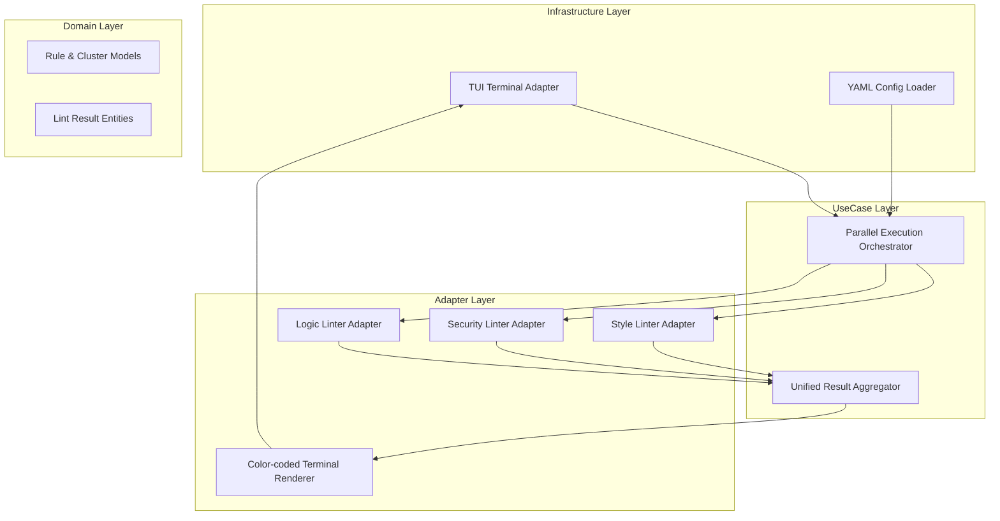

# Design Document: Modular Linting Plugin Architecture


## Overview


The Modular Linting Plugin Architecture introduces a decoupled execution engine designed for speed and clarity. The core strategy shifts from sequential execution to a parallelized, category-aware model. By grouping rules into Style, Security, and Logic clusters at the domain level, we enable targeted execution and reporting. The architecture remains backend-agnostic, allowing any third-party linter to be integrated via an adapter that maps results to our internal domain models.

The primary architectural change is the introduction of the 'Parallel Execution Orchestrator' and the 'Unified Result Aggregator'. These components sit between the user interface and the specific linting tools. Existing linting tools do not need modification; instead, we wrap them in adapters that implement our plugin protocol. This incremental approach allows us to keep existing configurations while providing a unified, high-performance interface.

The design philosophy prioritizes Developer Experience (DX) by delivering a color-coded TUI that emphasizes severity and category. By executing checks in parallel, we directly address the requirement to minimize 'Developer Idle Time', transforming linting from a slow gatekeeper into an instant feedback loop within the CI/CD pipeline.


## Architecture





## Components and Interfaces


### 1. Parallel Execution Orchestrator (`usecases`)


**Path:** `src/usecases/orchestrator.ts`

| Responsibility | Description |
|---|---|
| Parallelize execution of rule clusters | |
| Manage concurrency limits to prevent resource exhaustion | |
| Collect raw results from multiple adapter plugins | |


```python
interface ILintPlugin {
  category: 'Style' | 'Security' | 'Logic';
  execute(files: string[]): Promise<LintResult[]>;
}

class ParallelOrchestrator {
  async runAll(plugins: ILintPlugin[]): Promise<AggregatedReport> {
    const tasks = plugins.map(p => this.limit(() => p.execute(files)));
    const results = await Promise.all(tasks);
    return this.aggregator.combine(results.flat());
  }
}
```


### 2. Unified Result Aggregator (`usecases`)


**Path:** `src/usecases/aggregator.ts`

| Responsibility | Description |
|---|---|
| Normalize disparate plugin outputs into a unified format | |
| Cluster issues by their primary rule category | |
| Calculate summary statistics for repository health metrics | |


```python
interface StandardIssue {
  id: string;
  severity: 'error' | 'warning';
  category: 'Style' | 'Security' | 'Logic';
  message: string;
  location: { line: number; column: number; file: string };
}

class ResultAggregator {
  aggregate(results: LintResult[]): AggregatedReport {
    return results.reduce((report, res) => {
      report[res.category].push(this.mapToStandard(res));
      return report;
    }, new AggregatedReport());
  }
}
```


### 3. Color-coded TUI Renderer (`adapters`)


**Path:** `src/adapters/tui_renderer.ts`

| Responsibility | Description |
|---|---|
| Generate color-coded terminal output | |
| Group display by Rule Categories | |
| Provide summary dashboard for repository health overview | |


```python
class TUIRenderer {
  render(report: AggregatedReport): void {
    Object.entries(report.clusters).forEach(([category, issues]) => {
      process.stdout.write(this.formatHeader(category));
      issues.forEach(issue => {
        process.stdout.write(this.formatIssue(issue));
      });
    });
  }
  
  private formatHeader(cat: string): string {
    const colors = { Security: 'red', Style: 'blue', Logic: 'yellow' };
    return chalk[colors[cat]].bold(`\n=== ${cat} Cluster ===\n`);
  }
}
```


### 4. Core Domain Models (`domain`)


**Path:** `src/domain/models.ts`

| Responsibility | Description |
|---|---|
| Define immutable result structures | |
| Enforce type safety for rule categories | |


```python
export type RuleCategory = 'Style' | 'Security' | 'Logic';

export interface LintResult {
  readonly ruleId: string;
  readonly category: RuleCategory;
  readonly filePath: string;
  readonly message: string;
}
```


## Data Models


No new data models are introduced unless specified in the component descriptions above.


## Correctness Properties


*A property is a characteristic or behavior that should hold true across all valid executions of a system — essentially, a formal statement about what the system should do.*


### Property F0b-P1: Execution Efficiency Invariant


*For any set of executed plugins P, the total execution time T shall be less than or equal to (Sum of execution times in P / Parallelism Factor) + Orchestration Overhead.*

**Validates: Requirements 2**


### Property F0b-P2: Categorization Completeness


*For any LintResult R produced by a plugin, R.category must exist in {Style, Security, Logic} and be correctly captured in the AggregatedReport.*

**Validates: Requirements 1, 3**


### Property F0b-P3: Visual Alert Consistency


*For any TUI Render action, every Security-level issue must be rendered with an ANSI Red escape sequence.*

**Validates: Requirements 3**


## Error Handling


| Scenario | Handling |
|---|---|
| A specific linting plugin (e.g., Security scan) crashes or times out. | The Orchestrator catches the error, marks that specific category as 'Failed' in the report, and continues executing other category plugins. |
| Plugin returns a result with an unrecognized or missing category. | The Aggregator assigns a default 'Logic' category and logs a warning for plugin maintainers. |
| Terminal does not support ANSI colors. | TUI Renderer falls back to monochrome plain-text output. |


## Testing Strategy


The testing strategy focuses on ensuring concurrency safety and categorization accuracy. Regression testing will involve running the new Orchestrator against the existing monolithic test suite to ensure 100% parity in detected issues. CI verification will use 'time-limited' gates to ensure that parallel execution meets our performance benchmarks for 'Developer Idle Time'.

We will implement new property-based tests using 'fast-check'. For example, one test will generate thousands of random linting results across different files and categories, verifying that the Aggregator always produces a count that matches the input sum and that no categories are dropped. 

Testing configuration:
- Framework: vitest
- Parallelism: 4 workers (configurable in CI)
- Property Tests: 100 iterations per suite
- Tags: #F0b #Performance #Parallelization
