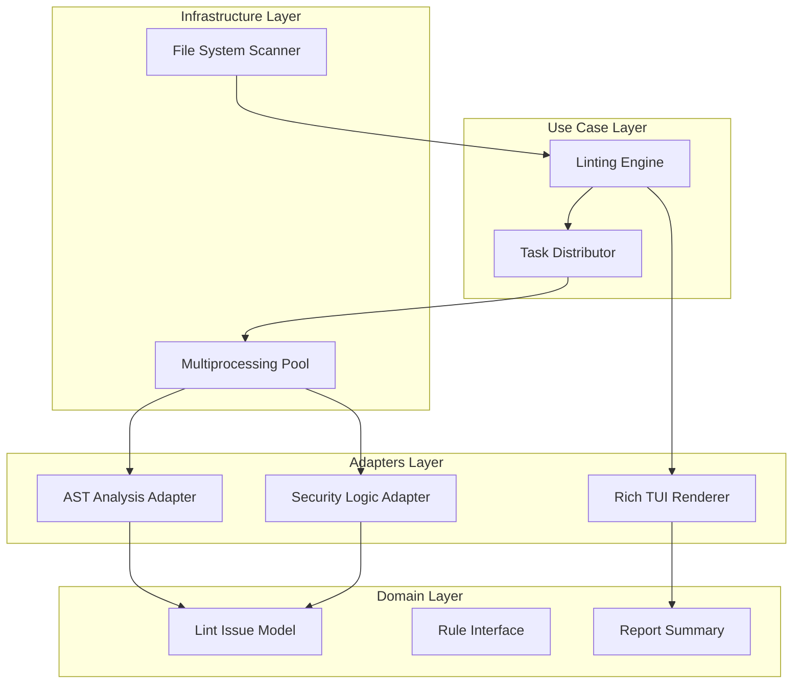

# Design Document: Comprehensive Python Rule Suite


## Overview


The design for the Comprehensive Python Rule Suite adopts a 'Decoupled Multi-Core' architecture. The core philosophy centers on high-performance parallel execution while maintaining strict domain boundaries between linting logic and reporting. We utilize a Map-Reduce pattern to distribute file-based linting tasks across system cores, ensuring that even massive repositories are scanned efficiently. 

Functionally, the system introduces a new AST-based analysis engine that replaces basic string-matching with structural code evaluation. The reporting layer is completely overhauled to prioritize developer aesthetics, using a Rich TUI to provide immediate, actionable feedback. While the underlying execution engine is new, the configuration format remains backwards compatible with common linter settings (e.g., .flake8 or pyproject.toml) to ensure ease of adoption.


## Architecture





## Components and Interfaces


### 1. Linting Engine (`usecases`)


**Path:** `src/usecases/engine.py`

| Responsibility | Description |
|---|---|
| Orchestrate the linting workflow | |
| Aggregate findings from multiple rules into a single report | |
| Manage execution state and high-level error boundaries | |


```python
class LintEngine:
    def execute(self, files: List[Path]) -> Report:
        tasks = self.parallelizer.split(files)
        raw_results = self.pool.map(self.run_rules, tasks)
        return self.aggregator.reduce(raw_results)
```


### 2. Rule Suite Adapters (`adapters`)


**Path:** `src/adapters/rules/suite.py`

| Responsibility | Description |
|---|---|
| Implement specific PEP 8 check logic | |
| Perform security vulnerability scanning | |
| Map raw Python AST nodes to domain Issue objects | |


```python
class IRule(Protocol):
    def check(self, code: str) -> List[Issue]: ...

class PEP8StyleRule(IRule):
    def check(self, code: str) -> List[Issue]:
        # AST traversal implementation
        pass

class SecurityRule(IRule):
    def check(self, code: str) -> List[Issue]:
        # Vulnerability scanning logic
        pass
```


### 3. Rich TUI Reporter (`adapters`)


**Path:** `src/adapters/ui/tui.py`

| Responsibility | Description |
|---|---|
| Render color-coded summary tables | |
| Format issues for terminal readability | |
| Calculate and display repository health metrics | |


```python
class RichReporter:
    def render(self, report: Report) -> None:
        table = Table(title="Repository Health Summary")
        for issue in report.issues:
            table.add_row(issue.code, issue.msg, style=issue.severity_style)
        console.print(table)
```


## Data Models


No new data models are introduced unless specified in the component descriptions above.


## Correctness Properties


*A property is a characteristic or behavior that should hold true across all valid executions of a system — essentially, a formal statement about what the system should do.*


### Property F1-P1: Aggregation Integrity


*For any execution of the Linting Engine, the total count of issues in the final Report must equal the sum of issues found by individual Rule Adapters across all parallel workers.*

**Validates: Requirements 4**


### Property F1-P2: Rule Compliance Coverage


*For any codebase containing a PEP 8 violation (e.g., E302 expected 2 blank lines), the PEP8StyleRule must return at least one Issue object with a SEVERITY_STYLE level.*

**Validates: Requirements 1**


### Property F1-P3: Incremental Efficiency


*For any file that has not been modified since the last successful scan, the Parallelizer must skip re-processing when incremental mode is enabled.*

**Validates: Requirements 4**


## Error Handling


| Scenario | Handling |
|---|---|
| Malformed Python file causing AST parser crash | The individual file task is logged as 'failed' in the report, but the engine continues processing other files to ensure the full suite completes. |
| User terminates process during parallel execution | The system catches the signal and performs a graceful shutdown of the WorkerPool, clearing any temporary buffers before exit. |
| Terminal does not support ANSI/Rich formatting | The system defaults to a standard non-colored plaintext output for compatibility. |


## Testing Strategy


The testing strategy employs a tiered approach. Regression testing is handled by running the new suite against a curated set of 'Golden Files'—known Python samples with documented PEP 8 and security issues—to ensure parity with existing tools. Continuous Integration (CI) will verify performance via a 'Large Repo Stress Test' executed on every pull request.

New Property-Based Tests (using Hypothesis) will be implemented to generate arbitrary (but syntactically valid) Python code to ensure the AST adapters do not crash under edge cases. Testing configuration will use 'pytest-xdist' for parallel test execution, and the property-based tests will be configured for 200 iterations per rule to satisfy the aggregation integrity invariants. Terminal output will be verified using the 'Console' capture features of the Rich library to ensure formatting consistency.
