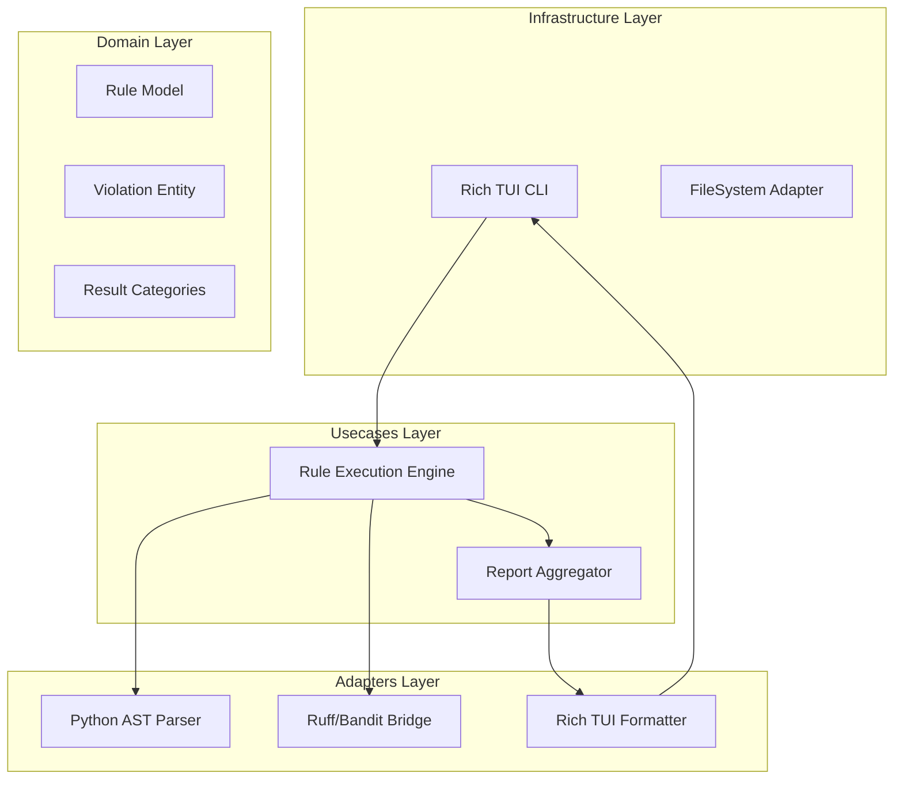

# Design Document: Comprehensive Python Rule Suite


## Overview


The design for the Comprehensive Python Rule Suite adopts a layered architecture strategy that decouples the linting logic (domain) from the execution of external tools (adapters). The core philosophy is to provide a unified interface for disparate check types—PEP 8 stylistics, logical error detection, and security scanning—while presenting them to the user through a prioritized Rich TUI. We will use a 'Composite Rule Provider' pattern to treat built-in checks and external tool bridges uniformly.

This implementation will not modify the existing file scanning infrastructure but will introduce a new 'Rule Engine' service. The engine acts as a pipeline: it first parses the Python source into an Abstract Syntax Tree (AST) for logical/security analysis, then passes the source through a regex-based style enforcer. This incremental approach allows us to integrate high-performance tools like Ruff and Bandit as adapters under a single domain-driven interface, ensuring Requirement 4's categorization and summarization is consistent regardless of the underlying tool.


## Architecture





## Components and Interfaces


### 1. Rule Execution Engine (`usecases`)


**Path:** `src/usecases/rule_engine.py`

| Responsibility | Description |
|---|---|
| Orchestrating rule execution flow | |
| Managing file parsing lifecycle | |
| Aggregating violations from multiple providers | |


```python
class RuleProvider(Protocol):
    def check(self, tree: ast.AST, source: str) -> List[Violation]:
        ...

class RuleEngine:
    def __init__(self, providers: List[RuleProvider]):
        self.providers = providers

    def execute(self, file_path: Path) -> AnalysisResult:
        tree = self.parser.parse(file_path)
        violations = []
        for p in self.providers:
            violations.extend(p.check(tree, source))
        return AnalysisResult(violations)
```


### 2. Report Aggregator (`usecases`)


**Path:** `src/usecases/report_aggregator.py`

| Responsibility | Description |
|---|---|
| Categorizing violations by severity and type | |
| Calculating summary statistics for the run | |
| Formatting data for TUI consumption | |


```python
class CategorizedReport:
    categories: Dict[RuleCategory, List[Violation]]
    summary: SummaryStats

    def add_violation(self, v: Violation):
        self.categories[v.category].append(v)
```


### 3. External Linter Bridge (`adapters`)


**Path:** `src/adapters/linter_bridge.py`

| Responsibility | Description |
|---|---|
| Translating external tool output to internal models | |
| Executing subprocess calls for security scanning | |
| Mapping error codes to priority levels | |


```python
class BanditAdapter(RuleProvider):
    def check(self, tree: ast.AST, source: str) -> List[Violation]:
        results = self._run_bandit_binary(source)
        return [Violation(
            category=RuleCategory.SECURITY,
            code=r.code,
            message=r.text
        ) for r in results]
```


## Data Models


No new data models are introduced unless specified in the component descriptions above.


## Correctness Properties


*A property is a characteristic or behavior that should hold true across all valid executions of a system — essentially, a formal statement about what the system should do.*


### Property F1-P1: Severity Prioritization Invariant


*For any violation identified as a 'Security' or 'Logical' risk, its priority in the Rich TUI must be higher than any 'Style' violation.*

**Validates: Requirements 4.0**


### Property F1-P2: Security Detection Coverage


*For any input Python source code containing common injection patterns (e.g., eval(), subprocess.shell=True), the Security scan must produce at least one Violation with Category.SECURITY.*

**Validates: Requirements 3.0**


### Property F1-P3: PEP 8 Compliance Enforcement


*For any source file lacking trailing newlines or having incorrect indentation, a PEP 8 Style Violation must be emitted.*

**Validates: Requirements 1.0**


## Error Handling


| Scenario | Handling |
|---|---|
| Python file contains invalid syntax preventing AST generation | Fallback to basic syntax checking; report 'Logical Error' category for unparsable files. |
| External security tool (Bandit) is missing from the environment | Gracefully catch Exception, emit a 'Bridge Failure' warning in the TUI, and continue with style checks. |
| Source file uses incompatible encoding | Catch UnicodeDecodeError and report as a 'File Access' error category. |


## Testing Strategy


The testing strategy employs a multi-tiered approach. Regression testing will utilize the existing 'pytest' suite to ensure that introducing the new Rule Engine does not break file ingestion or CLI command parsing. CI verification will be handled via GitHub Actions, running 'pytest --cov' to ensure 90%+ coverage on usecase logic.

For Requirement-specific validation, we will introduce Property-Based Testing using the 'Hypothesis' library. We will generate Python ASTs and source strings with specific 'tainted' patterns (e.g., missing docstrings or dangerous eval() calls) and assert that the Rule Engine consistently categorizes these as STYLE and SECURITY respectively. These tests will be tagged '@property_test' and configured to run 100 iterations per scenario. We will also perform 'Gold Master' testing for the Rich TUI by capturing terminal output snapshots to confirm that categorization and color-coding remain visually consistent across updates.
