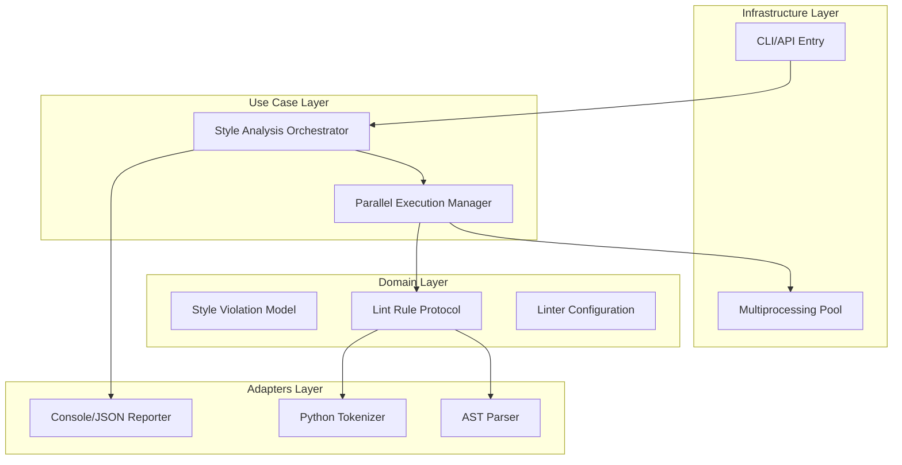

# Design Document: PEP 8 Style Checker

## Overview

The PEP 8 Style Checker (F1) is designed as a high-performance, parallelized linting engine that integrates deeply with Python's native AST and tokenization capabilities. The design philosophy emphasizes 'Single Pass Analysis' where each file is read, tokenized, and parsed only once per execution, with multiple 'Rule' objects visiting the generated structures. This minimizes I/O and CPU overhead, which is critical for large-scale DevOps environments.

The architecture adopts a Clean Architecture approach, separating the core linting logic (Domain) from the execution orchestration (Use Cases) and the specific Python parsing libraries (Adapters). This ensures that the engine remains maintainable as PEP 8 evolves or as the project adopts newer Python syntax versions. The primary change to the existing system is the introduction of a multiprocessing-aware runner that handles IPC (Inter-Process Communication) of linting results, replacing any legacy sequential processing.

Technically, the strategy relies on the 'Worker Pool' pattern to saturate available CPU cores. Each worker is independent and stateless, ensuring that parallelization does not introduce race conditions or flaky results. The naming convention and indentation checks are implemented as pluggable rules, allowing for high extensibility and strict adherence to the DX-First/Scale-Obsessed requirements.

## Architecture

## Data Models

No new data models are introduced unless specified in the component descriptions above.

## Testing Strategy

The testing strategy maximizes reliability through a combination of standard unit tests and Property-Based Testing (PBT). 

1. **Regression Testing**: We will utilize the existing `pytest` suite to ensure no regressions in file I/O or CLI argument parsing.
2. **Property-Based Testing**: Using the `Hypothesis` library, we will generate arbitrary Python-like strings to verify that the Naming Convention and Indentation rules never crash (the 'no-crash' property) and that they correctly identify violations in randomly generated malformed code.
3. **CI Verification**: The CI pipeline will execute the linter on the project's own codebase (self-linting) using the command `python -m pytest tests/performance --max-iters 100`.
4. **Configuration**: Tests will be tagged with `@pytest.mark.style` and run across 500 iterations for PBT to ensure edge cases in the AST parser are covered. Parallel execution will be validated by comparing the output of a `--sequential` flag against the default parallel mode to ensure identical violation lists.
