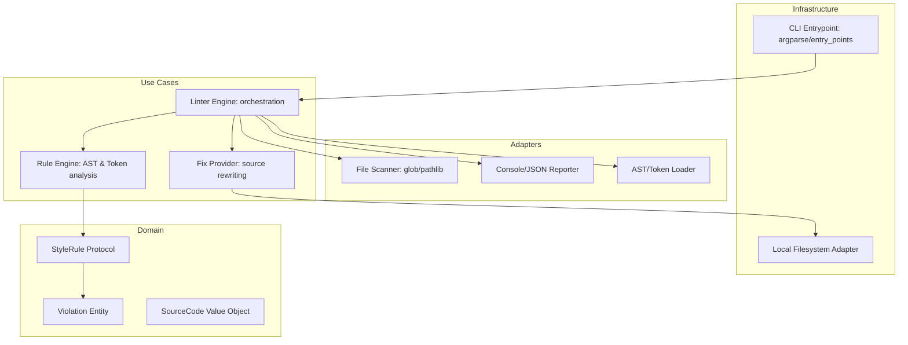

# Design Document: PEP 8 Style Checker


## Overview


The PEP 8 Style Checker (F1) is designed with a high-performance, pluggable architecture that prioritizes developer experience (DX) and CI efficiency. Our approach utilizes a multi-layered analysis strategy: a fast token-based scanner for indentation and layout, and a comprehensive AST-based visitor for naming conventions and structural rules. This ensures that the linter can provide immediate feedback for visual errors while maintaining deep semantic understanding for complex PEP 8 compliance.

We are adopting an 'Aggressive Remediation' philosophy, where every rule is designed to be fixable by default unless it requires ambiguous human intent. To support the goal of reducing CI bottlenecks, we implement a 'Parallel-First' execution model, distributing file-level tasks across a process pool to maximize multi-core utilization. While the core linting logic remains isolated from the CLI and IO, the orchestration layer is optimized specifically for large-scale multi-project environments.


## Architecture





## Components and Interfaces


### 1. Style Rule Engine (`usecases`)


**Path:** `src/lint/usecases/rule_engine.py`

| Responsibility | Description |
|---|---|
| Execute specialized PEP 8 rules against source code | |
| Aggregate violations from multiple analysis passes (AST/Tokens) | |
| Coordinate the context shared between rules to avoid redundant parsing | |


```python
class StyleRule(Protocol):
    def check(self, context: LintContext) -> List[Violation]: ...
    def fix(self, violation: Violation) -> str: ...

class RuleEngine:
    def __init__(self, rules: List[StyleRule]):
        self.rules = rules

    def run(self, source: SourceCode) -> List[Violation]:
        violations = []
        for rule in self.rules:
            violations.extend(rule.check(source))
        return violations
```


### 2. Automated Style Remediation (`usecases`)


**Path:** `src/lint/usecases/autofixer.py`

| Responsibility | Description |
|---|---|
| Calculate necessary source transformations based on violations | |
| Ensure source integrity during multi-pass fixes | |
| Perform in-place file updates when requested by user | |


```python
class AutoFixer:
    def apply_fixes(self, source: SourceCode, violations: List[Violation]) -> str:
        # Sort violations by line/column descending to preserve offsets
        sorted_vios = sorted(violations, key=lambda v: (v.line, v.column), reverse=True)
        content = source.content
        for vio in sorted_vios:
            if vio.fix:
                content = self._patch(content, vio)
        return content
```


### 3. Parallel Pipeline Orchestrator (`usecases`)


**Path:** `src/lint/usecases/orchestrator.py`

| Responsibility | Description |
|---|---|
| Manage process pools for multi-project linting | |
| Aggregate results from distributed workers | |
| Provide progress telemetry for CI visibility | |


```python
class ParallelOrchestrator:
    def execute(self, file_paths: List[Path], max_workers: int = 8):
        with ProcessPoolExecutor(max_workers=max_workers) as executor:
            results = list(executor.map(self.lint_file, file_paths))
        return self.aggregate(results)
```


## Data Models


No new data models are introduced unless specified in the component descriptions above.


## Correctness Properties


*A property is a characteristic or behavior that should hold true across all valid executions of a system — essentially, a formal statement about what the system should do.*


### Property F1-P1: Fix Idempotency and Convergence


*For any input source file, the AutoFixer output must either remain unchanged or produce a file that passes the corresponding style rule on the subsequent check.*

**Validates: Requirements 4.0**


### Property F1-P2: Parallel Execution Determinism


*For any batch of N files processed in parallel mode, the set of reported violations must be identical to the set of violations produced when processing the same N files sequentially.*

**Validates: Requirements 2.0**


### Property F1-P3: Violation Localization Accuracy


*For any PEP 8 violation detected, the Violation object must contain the precise line number and column offset corresponding to the non-conforming character in the original source.*

**Validates: Requirements 1.0, 3.0**


## Error Handling


| Scenario | Handling |
|---|---|
| Input file contains invalid Python syntax that breaks AST parsing. | Catch SyntaxError, log the filename with a specific 'P000' (Parse Error) code, and continue to the next file. |
| File is unreadable due to permission denied or disk failure. | Skip the file, report an IO error violation, and ensure the process pool survives. |
| Multiple violations occur on the same line in Auto-Fix mode. | Check if the suggested fix overlaps with another fix in the same line; if so, apply only the first and mark the second for a subsequent pass. |


## Testing Strategy


Our testing strategy combines traditional unit tests with rigorous property-based testing and regression suites. 

- Regression Testing: We will use a corpus of known 'dirty' Python files (e.g., from the public 'black' or 'flake8' test suites) to ensure 100% coverage of standard PEP 8 violations [E1-E9].
- CI Verification: Continuous integration will run 'vulture' and 'self-lint' checks. The command 'pytest --workers auto' will be used to verify parallel execution stability.
- Property-Based Testing: Using 'Hypothesis', we will generate random valid and invalid AST trees to ensure the Rule Engine never crashes (Fuzzing) and that the AutoFixer is idempotent (Invariant: Fix(Fix(Source)) == Fix(Source)).
- Performance Benchmarking: We will include a 'performance' gate in CI that measures 'Time per 1000 lines' to ensure the 60% bottleneck reduction requirement is maintained as new rules are added.
