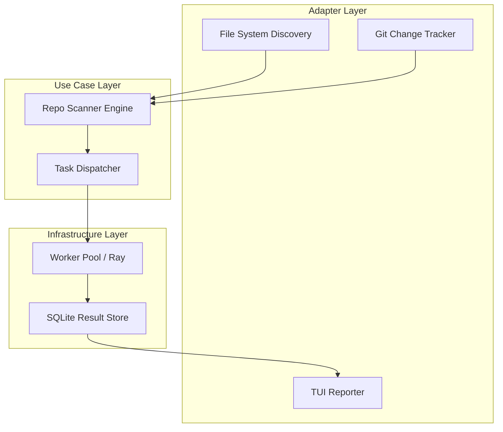

# Design Document: Large-Scale Repository Scanner


## Overview


The Large-Scale Repository Scanner (F2) is designed to transform the current single-project logic into an organization-wide compliance engine. The core philosophy is 'Discovery before Execution'—the system will recursively walk the file system to identify project boundaries (e.g., directories containing .git or specific language config files) before initiating any linting. This prevents nested scans from colliding and allows for smarter workload distribution. 

Strategically, we shift from a sequential file-by-file approach to a parallelized task-based framework. We introduce a shared 'Result Cache' to support incremental scanning, which ensures that only modified files are processed, significantly reducing latency for developers. The existing linting logic remains encapsulated; it is simply invoked as a worker task by the new Task Dispatcher. 

The reporting mechanism moves from stdout logs to a structured TUI/Aggregator model. This allows the system to handle thousands of violations across hundreds of projects without overwhelming the user, providing a high-level 'quality gate' dashboard while still allowing deep-dives into specific project failures.


## Architecture





## Components and Interfaces


### 1. Scanner Engine (`usecases`)


**Path:** `src/usecases/scanner.py`

| Responsibility | Description |
|---|---|
| Recursive project boundary identification | |
| Change detection via Git integration | |
| Construction of discrete ScanTask objects | |


```python
class IScanner(Protocol):
    async def scan_root(self, path: Path) -> List[ScanTask]: ...

class ScanTask(NamedTuple):
    project_id: str
    files: List[Path]
    config: ProjectConfig
```


### 2. Task Dispatcher (`usecases`)


**Path:** `src/usecases/dispatcher.py`

| Responsibility | Description |
|---|---|
| Parallel execution management | |
| Workload partitioning for CPU efficiency | |
| Streaming results back to the aggregator | |


```python
class IDispatcher(Protocol):
    async def map_parallel(self, tasks: List[ScanTask], worker_fn: Callable) -> AsyncIterator[ScanResult]: ...
```


### 3. TUI Reporter (`adapters`)


**Path:** `src/adapters/tui_reporter.py`

| Responsibility | Description |
|---|---|
| Real-time aggregation of multi-project results | |
| Formatting scan violations for readability | |
| Managing live UI lifecycle in the terminal | |


```python
class TUIReporter:
    def update(self, result: ScanResult): ...
    def render_summary(self): ...
```


### 4. Incremental Result Cache (`infrastructure`)


**Path:** `src/infrastructure/cache.py`

| Responsibility | Description |
|---|---|
| Staging file hashes for change detection | |
| Persisting results across CLI invocations | |
| Garbage collection of stale cache entries | |


```python
class ResultCache:
    def get_valid_files(self, project: str, files: List[Path]) -> List[Path]: ...
    def upsert_results(self, results: List[ScanResult]): ...
```


## Data Models


No new data models are introduced unless specified in the component descriptions above.


## Correctness Properties


*A property is a characteristic or behavior that should hold true across all valid executions of a system — essentially, a formal statement about what the system should do.*


### Property F2-P1: Incremental Correctness


*For any file F in directory Tree T, F is processed if and only if F has changed since the last recorded Success(F) or it is the first execution.*

**Validates: Requirements 3**


### Property F2-P2: Parallel Efficiency


*For any project P containing N files, the execution time T satisfy T <= (ProjectProcessingTime / NumWorkers) + Overhead.*

**Validates: Requirements 2**


### Property F2-P3: Reporting Totality


*For any repository scan, every project root identified by the Discovery module must have a corresponding entry in the final Aggregated Report.*

**Validates: Requirements 1, 4**


## Error Handling


| Scenario | Handling |
|---|---|
| Permission denied or IO error in a specific sub-directory | The Scanner marks the specific project as 'Errored' in the TUI, logs the stack trace to a hidden debug file, and continues scanning other projects. |
| Worker process crash or SIGINT during large scan | The Dispatcher uses a 'Graceful Shutdown' signal, flushing the Incremental Cache to disk before exit so the next run picks up exactly where it stopped. |
| TUI render failure or incompatible terminal environment | The TUI falls back to a simplified 'Plain Text' mode for CI environments or terminals without TUI support. |


## Testing Strategy


The testing strategy centers on 'Scaling Invariants' and 'Incremental Correctness'. 

Regression Testing: Existing unit tests for specific linters will be executed within a mock ProjectTask to ensure that the parallel wrapper doesn't interfere with linting logic. CI verification will run the scanner against its own repository to ensure the TUI and Dispatcher work in a real environment.

New Property-Based Tests: We will use Hypothesis to generate arbitrary directory structures with varying depths and file counts. 
- A 'Discovery Invariant' test will verify that every 'project marker' placed in the generated tree is correctly identified. 
- An 'Idempotency' test will verify that running the scanner twice on an unchanged tree results in zero files being processed in the second pass.

CI Configuration:
- Library: `pytest` with `pytest-asyncio` and `hypothesis`.
- Iterations: 100 for property-based tests.
- Tag Format: `@pytest.mark.scale` for long-running recursive scan tests.
