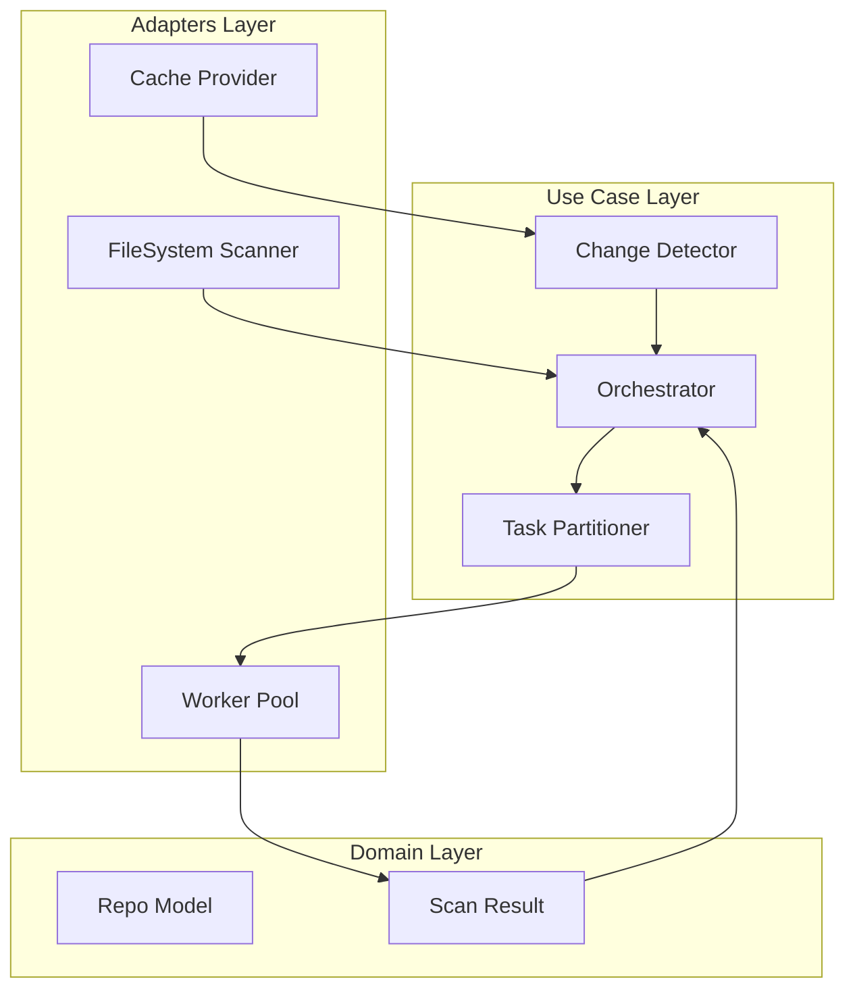

# Design Document: Large-Scale Repository Scanner


## Overview


The Large-Scale Repository Scanner (F2) is designed to handle massive monorepos by shifting from a sequential, single-threaded discovery model to a parallelized, delta-aware architecture. The core philosophy centers on 'Work Minimization'—if a file hasn't changed, the scanner shouldn't touch it. This is achieved through a robust FileSystem Adapter that implements incremental progress tracking using file fingerprints (mtime and size). 

The system utilizes a 'Producer-Consumer' parallelization strategy. A main process performs rapid file discovery and partitions the work into balanced chunks, which are then consumed by a pool of worker processes. This approach minimizes the Global Interpreter Lock (GIL) contention and ensures that multi-core systems are fully saturated. 100% coverage is guaranteed by a recursive discovery engine that ignores only explicitly excluded directories (like .git or venv), while security quality gates are enforced at the aggregation layer of the Orchestrator, ensuring that a 'Critical' finding in any sub-project blocks the entire pipeline.


## Architecture





## Components and Interfaces


### 1. Scan Orchestrator (`usecases`)


**Path:** `src/usecases/orchestrator.py`

| Responsibility | Description |
|---|---|
| Coordinate between discovery and partitioning modules | |
| Aggregate results from multiple worker processes | |
| Manage the overall scan lifecycle and state transition | |


```python
class IScanOrchestrator(Protocol):
    async def run_scan(self, root_path: Path) -> ScanSummary:
        \"\"\"Executes a full or incremental scan based on workspace state\"\"\"
```


### 2. Task Partitioner (`usecases`)


**Path:** `src/usecases/partitioner.py`

| Responsibility | Description |
|---|---|
| Calculate optimal distribution of files across CPU cores | |
| Minimize idle time during parallel execution | |
| Handle project-level grouping to maintain logical context if needed | |


```python
def partition_tasks(files: List[FileInfo], core_count: int) -> List[List[FileInfo]]:
    \"\"\"Splits files into N balanced chunks based on size and count\"\"\"
```


### 3. FileSystem Adapter (`adapters`)


**Path:** `src/adapters/filesystem.py`

| Responsibility | Description |
|---|---|
| Recursive file discovery using memory-efficient generators | |
| Filtering based on .gitignore and style-guide exclusions | |
| Delta tracking via file fingerprinting (mtime/hash) | |


```python
class FileScanner:
    def get_python_files(self, root: Path) -> Generator[FileInfo, None, None]:
        \"\"\"Recursively yields python files avoiding symlink loops\"\"\"
    
    def get_changed_files(self, files: List[FileInfo], cache: ScanCache) -> List[FileInfo]:
        \"\"\"Filters files based on checksum/mtime delta\"\"\"
```


### 4. Parallel Execution Pool (`infrastructure`)


**Path:** `src/infrastructure/worker_pool.py`

| Responsibility | Description |
|---|---|
| Manage lifecycle of worker processes | |
| Execute security/style checks in parallel isolation | |
| Aggregate stdout/stderr from concurrent tasks | |


```python
class ParallelWorkerPool:
    def execute_batch(self, chunks: List[List[FileInfo]], task_fn: Callable) -> List[TaskResult]:
        \"\"\"Maps task_fn over chunks across N processes\"\"\"
```


## Data Models


No new data models are introduced unless specified in the component descriptions above.


## Correctness Properties


*A property is a characteristic or behavior that should hold true across all valid executions of a system — essentially, a formal statement about what the system should do.*


### Property F2-P1: Incremental Completeness Invariant


*For any scan execution, the set of files processed must equal the union of files modified since the last recorded timestamp and files that have never been successfully scanned.*

**Validates: Requirements 3**


### Property F2-P2: Maximum Parallelism Invariant


*For any repository with N files and P available processor cores where N > P, the scan must utilize P active processes until the work queue is exhausted.*

**Validates: Requirements 2**


### Property F2-P3: Security Gate Failure Invariant


*For any scan result containing a 'Critical' severity vulnerability, the Orchestrator must return a non-zero exit code and stop the CI pipeline.*

**Validates: Requirements 4**


## Error Handling


| Scenario | Handling |
|---|---|
| File Permission Denied / IO Error during discovery | The Orchestrator catches the exception, logs the file path as 'Error', and continues scanning remaining files to ensure a single corrupt file doesn't block the whole repo. |
| Worker process crashes due to Memory Limit (OOM) | The Worker Pool detects the process exit, restarts the worker process, and marks all tasks in that chunk as 'Failed'. |
| Cache file is corrupted or version mismatch | The Orchestrator falls back to a full scan of all files and logs a warning for the user. |


## Testing Strategy


The testing strategy focuses on high-volume simulation and state-based verification. Regression testing will utilize the existing style-check test suite, but wrapped in a 'ParallelRunner' test harness to ensure that concurrent execution doesn't introduce race conditions in result reporting. 

CI verification will be performed using a 10,000-file 'synthetic monorepo' generated during the build setup. We will use `pytest-xdist` for running the tests themselves, but the system's own parallelization will be verified by inspecting the `ScanSummary` metadata.

Property-based testing (using Hypothesis) will be employed for the Task Partitioner. Specifically, we will generate random lists of file sizes and core counts to verify that the 'Maximum Parallelism Invariant' holds (i.e., that work is distributed as evenly as possible). 

Testing Configuration:
- Framework: pytest with hypothesis
- Iterations for property tests: 200
- Tagging: All scale tests will be tagged `@pytest.mark.performance` to allow separation from fast unit tests.
- Environment: Tests will be run in a Docker container limited to 2 CPUs to verify ceiling-limit handling.
