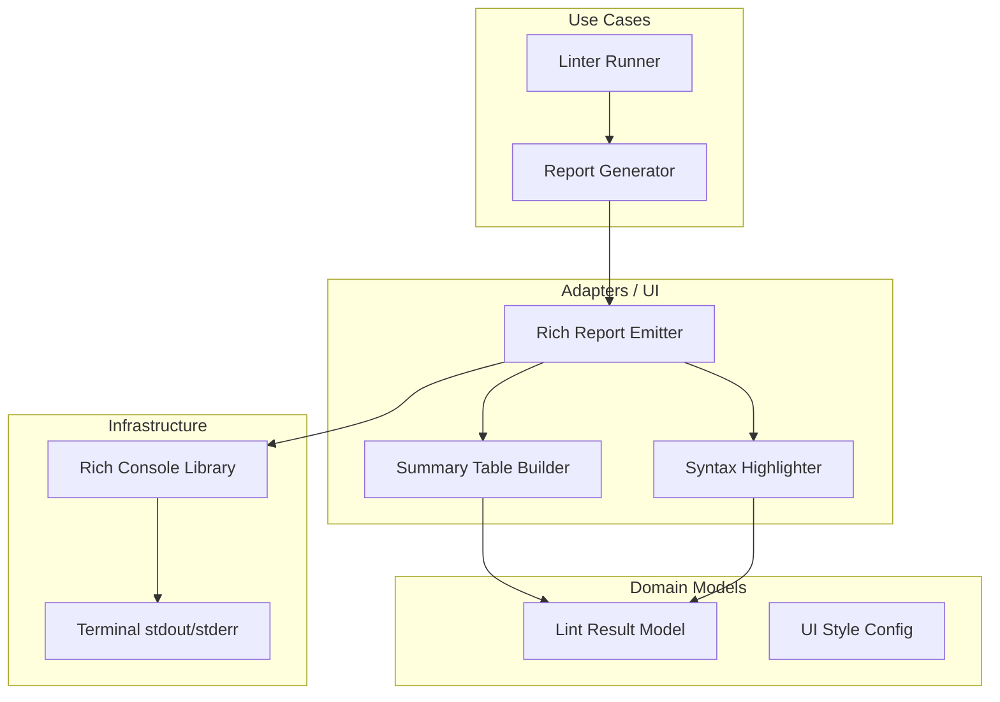

# Design Document: Rich Visual Terminal UI


## Overview


The Rich Visual Terminal UI (F2) is designed to transform the linter from a standard CLI tool into a high-fidelity diagnostic dashboard. The core strategy leverages the 'Rich' library to create a structured, aesthetic output that balances the needs of individual developers (code context) and DevOps engineers (summary stats). We are moving from single-line string outputs to a multi-stage rendering pipeline that constructs the report as a tree of visual components.

The implementation follows a non-destructive incremental approach: the existing data collection logic remains untouched, while a new 'RichEmitter' class is introduced in the adapters layer to replace the legacy stdout print statements. This separation ensures that the core linting engine remains decoupled from the presentation logic, allowing for alternate output formats (like JSON or HTML) in the future without modification to the domain.

The design philosophy prioritizes clarity and context. Instead of just stating an error, the TUI will 'show' the error through syntax-highlighted blocks. The health summary is positioned at the end of the output to serve as the definitive status check for CI/CD environments, ensuring that the most critical 'pass/fail' information is the last thing a user or script sees.


## Architecture





## Components and Interfaces


### 1. Rich Report Emitter (`adapters`)


**Path:** `src/adapters/ui/rich_emitter.py`

| Responsibility | Description |
|---|---|
| Orchestrate the visual layout of the linter report | |
| Determine terminal capabilities for color support | |
| Combine syntax blocks and summary tables into a single output stream | |


```python
class RichEmitter:
    def __init__(self, console: Console, theme: Dict[str, str]):
        self.console = console
        self.theme = theme

    def emit_report(self, results: List[LintResult]) -> None:
        # 1. Header with metadata
        # 2. Results list with Syntax blocks
        # 3. Summary Footer with Health Table
        pass
```


### 2. Syntax Highlighter (`adapters`)


**Path:** `src/adapters/ui/syntax_prettifier.py`

| Responsibility | Description |
|---|---|
| Extract code snippets from source files based on error coordinates | |
| Apply syntax-aware coloring based on file extensions | |
| Format code panels with line numbers and focus highlights | |


```python
class SyntaxPrettifier:
    def get_highlighted_block(self, 
                               file_path: str, 
                               line_no: int, 
                               highlight_line: bool = True) -> Panel:
        syntax = Syntax.from_path(
            file_path, 
            line_numbers=True, 
            theme="monokai",
            highlight_lines={line_no}
        )
        return Panel(syntax, title=file_path)
```


### 3. Summary Table Builder (`adapters`)


**Path:** `src/adapters/ui/table_builder.py`

| Responsibility | Description |
|---|---|
| Aggregate lint results into statistical categories | |
| Generate a formatted Rich Table object for summary display | |
| Apply conditional styling based on error thresholds (e.g., red if > 0 errors) | |


```python
class TableBuilder:
    def build_summary_table(self, summary_data: Dict[str, int]) -> Table:
        table = Table(title="Repository Health Summary")
        table.add_column("Category", style="cyan")
        table.add_column("Count", justify="right", style="magenta")
        for cat, count in summary_data.items():
            table.add_row(cat, str(count))
        return table
```


## Data Models


No new data models are introduced unless specified in the component descriptions above.


## Correctness Properties


*A property is a characteristic or behavior that should hold true across all valid executions of a system — essentially, a formal statement about what the system should do.*


### Property F2-P1: Completeness of Summary Aggregation


*For any execution run, the output must generate a summary table containing a count of all identified LintResult objects grouped by their severity level.*

**Validates: Requirements 3.1, 4.1**


### Property F2-P2: Snippet Fidelity


*For any code snippet displayed in the TUI, the content must be identical to the source file lines at the reported coordinates [line_start, line_end].*

**Validates: Requirements 2.1, 2.2**


### Property F2-P3: CI Transparency


*For any environment where the terminal is detected as a non-interactive pipe (CI context), the output must maintain a valid return code and a clean stream regardless of color capabilities.*

**Validates: Requirements 4.1, 4.2**


## Error Handling


| Scenario | Handling |
|---|---|
| Source file renamed or deleted between linting and reporting phase. | The SyntaxPrettifier catches FileNotFoundError and returns a placeholder text panel 'Source unavailable'. |
| Terminal window is too narrow for the summary table. | Rich library automatically detects terminal width; the emitter uses 'expand=True' and 'soft_wrap=True' to prevent layout break. |
| TUI is executed in a terminal that does not support ANSI colors or Unicode. | The system forces NO_COLOR=1 and uses standard ASCII characters for the health table. |


## Testing Strategy


The testing strategy centers on 'Snapshot Testing' and 'Property-Based UI Verification'. 

**Regression Testing:** We will maintain existing logic tests for linter accuracy, but we will wrap the terminal output in a 'Console.capture()' block to verify that the visual transformation does not omit any raw data points from the previous version. 

**CI Verification:** The CI pipeline will run the linter with 'FORCE_COLOR=0' and 'TERM=dumb' to ensure that the TUI logic gracefully degrades and doesn't crash in environments without complex terminal drivers. We will use the command 'pytest tests/ui --snapshot-update' to compare current output against gold-standard terminal renders.

**New Property-Based Tests:** Using the 'Hypothesis' library, we will generate arbitrary 'LintResult' lists (extreme counts, very long file paths, invalid UTF-8 characters) to ensure the UI components (TableBuilder, SyntaxPrettifier) never raise an exception, regardless of the input data.

**Configuration:** Testing will utilize 'rich.console.Console' with 'width=80' and 'width=120' forced configurations to test layout responsiveness. Snapshots will be stored in '.svg' or '.txt' format in the 'tests/snapshots' directory.
