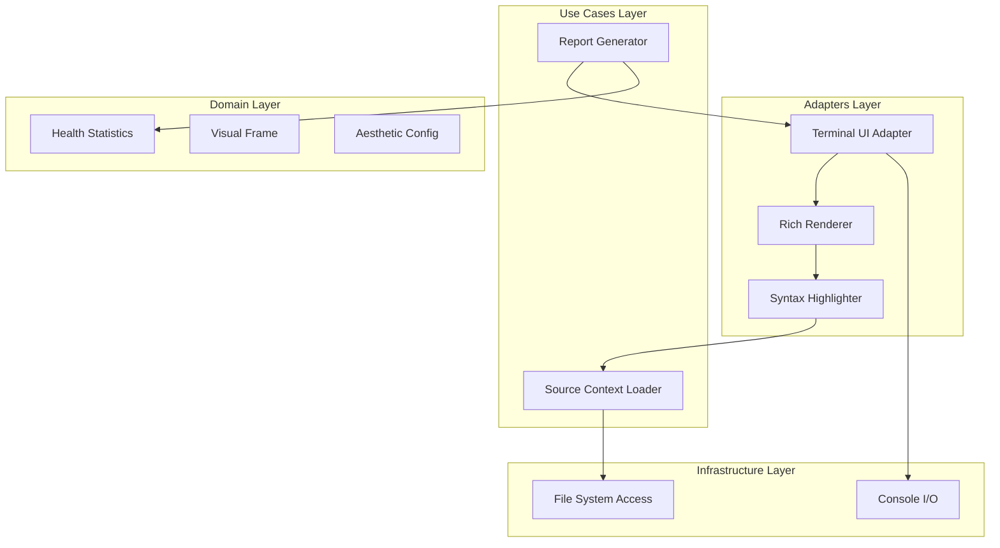

# Design Document: Rich Visual Terminal UI


## Overview


The Rich Visual Terminal UI (F2) feature adopts an 'Aesthetics-First' strategy, utilizing the 'Rich' Python library to transform flat text logs into a structured, high-fidelity diagnostic dashboard. The design philosophy focuses on 'Information Density with Clarity'—maximizing the data displayed (code context, health tables, severity distribution) while minimizing cognitive load through consistent color-coding and spatial separation. 

The implementation follows an incremental adapter approach: the core linting engine remains untouched, while a new 'TUIAdapter' is introduced to intercept the final 'LintResult' domain object. We shift from a line-by-line printing model to a layout-based model where the terminal screen is treated as a set of logical zones. This ensures that the Health Table (Requirement 3) always appears as a consolidated summary, while Inline Fragments (Requirement 2) provide deep-dive diagnostics.


## Architecture





## Components and Interfaces


### 1. Terminal UI Adapter (`adapters`)


**Path:** `src/adapters/tui_adapter.py`

| Responsibility | Description |
|---|---|
| Orchestrate the visual layout of the report | |
| Map domain linting models to Rich renderables | |
| Manage terminal console state and color depth | |


```python
class TerminalUIAdapter(UIProvider):
    def render_report(self, results: LintResults, stats: RepositoryStats):
        layout = self._build_layout()
        layout["header"].update(self._header())
        layout["summary"].update(self._health_table(stats))
        layout["body"].update(self._issue_list(results))
        self.console.print(layout)
```


### 2. Syntax Highlighter (`adapters`)


**Path:** `src/adapters/syntax_highlighter.py`

| Responsibility | Description |
|---|---|
| Load source code snippets dynamically | |
| Apply language-aware syntax highlighting | |
| Generate visual column pointers for errors | |


```python
class SyntaxHighlighter:
    def highlight_fragment(self, file_path: str, line_no: int, col_no: int) -> Group:
        lines = self.loader.get_context(file_path, line_no)
        syntax = Syntax("\n".join(lines), self._map_ext(file_path), theme="monokai", line_numbers=True, start_line=line_no-2)
        return Panel(syntax, title=f"{file_path}:{line_no}")
```


### 3. Repository Health Aggregator (`domain`)


**Path:** `src/domain/health_aggregator.py`

| Responsibility | Description |
|---|---|
| Aggregate linting errors by type and severity | |
| Calculate repository health metrics | |
| Provide data structures for table rendering | |


```python
@dataclass(frozen=True)
class RepositoryStats:
    total_files: int
    issue_counts: Dict[Severity, int]
    health_score: float

    def get_summary_row(self) -> List[str]:
        return [str(self.total_files), str(self.issue_counts[Severity.ERROR])]
```


## Data Models


No new data models are introduced unless specified in the component descriptions above.


## Correctness Properties


*A property is a characteristic or behavior that should hold true across all valid executions of a system — essentially, a formal statement about what the system should do.*


### Property F2-P1: Statistical Integrity


*For any LintResult set, the sum of errors in the Categorized Health Table must exactly equal the total count of issues in the domain model.*

**Validates: Requirements 3.1**


### Property F2-P2: Visual Context Accuracy


*For any SyntaxHighlightedFragment, the line number indicated in the visual UI must match the actual source file line number where the violation exists.*

**Validates: Requirements 2.1**


### Property F2-P3: Layout Resilience


*For any terminal output, all visual components (Table, Panel, Syntax) must render without character corruption regardless of terminal width (down to 80 chars).*

**Validates: Requirements 1.1**


## Error Handling


| Scenario | Handling |
|---|---|
| Source code file is deleted or inaccessible during report generation. | The UI falls back to displaying the FilePath and ErrorMessage without the code block if I/O fails. |
| Output is redirected to a non-TTY pipe or a terminal without 256-color support. | The TUI automatically disables all ANSI color codes and shifts to a basic Markdown-style layout. |


## Testing Strategy


The testing strategy utilizes a combination of visual regression tests and property-based verification. Regression testing will use 'Rich's' Console logging capture to compare snapshots of TUI output against known-good 'golden' files, ensuring no layout shifts occur during refactoring. CI verification will run 'pytest' with color-cycling to ensure no exceptions are raised during string formatting across different terminal emulations.

New property-based tests using Hypothesis will generate randomized linting results (variable severities, long file paths, and multi-byte characters) to verify that the 'Repository Health Table' always calculates sums correctly and the 'SyntaxHighter' handles edge cases like empty files or single-character lines. Character encoding will be specifically tested using UTF-8 and ASCII-only environments to ensure the TUI remains readable in restricted shells.

Configuration for tests will target 100 iterations per property test, tagged with '@tui-suite', using the 'pytest-rich' plugin to verify the visual components themselves produce valid renderables.
