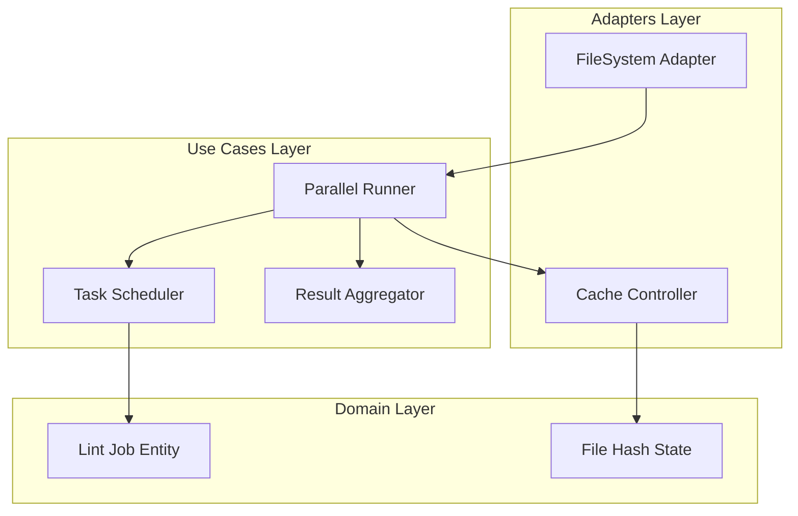

# Design Document: Parallel Execution Runner Logic


## Overview


The F3 feature focuses on transforming the linter from a single-threaded sequential tool into a high-performance parallel engine. The core strategy employs a Process-based concurrency model using Python's 'concurrent.futures', which avoids GIL limitations and maximizes CPU utilization across all available cores. This is essential for maintaining high throughput in CI/CD environments where massive repositories must be validated within minutes.

The design introduces an incremental processing layer that uses SHA-256 content hashing to determine if a file needs re-evaluation. While the rule logic remains unchanged, the execution flow is refactored into a 'Scatter-Gather' architecture. This approach ensures that the runner remains decoupled from the specific rules it executes, allowing for future rule additions without modifying the parallelization logic. Incremental state is persisted locally, enabling fast iterative 'lint-on-save' workflows for developers.


## Architecture





## Components and Interfaces


### 1. Parallel Runner Orchestrator (`usecases`)


**Path:** `src/usecases/parallel_runner.py`

| Responsibility | Description |
|---|---|
| Orchestrate the end-to-end linting execution flow | |
| Filter files based on incremental cache hits | |
| Coordinate worker pool allocation based on CPU core count | |
| Aggregate individual file reports into a global result set | |


```python
class IRunner(Protocol):
    async def run_parallel(self, paths: List[Path], max_workers: int) -> Summary:
        \"\"\"Executes linting rules across multiple cores.\"\"\"

class ParallelRunner(IRunner):
    def __init__(self, scheduler: IScheduler, cache: ICache):
        self.scheduler = scheduler
        self.cache = cache
```


### 2. Task Scheduler (`usecases`)


**Path:** `src/usecases/scheduler.py`

| Responsibility | Description |
|---|---|
| Manage ProcessPoolExecutor lifecycle | |
| Chunk file lists to optimize inter-process communication (IPC) | |
| Handle worker timeout and resource cleanup | |


```python
class TaskScheduler:
    def __init__(self, workers: int = None):
        self.executor = ProcessPoolExecutor(max_workers=workers)

    async def schedule_batch(self, tasks: List[LintTask]) -> List[RuleResult]:
        \"\"\"Dispatches tasks to the process pool and awaits results.\"\"\"
```


### 3. Incremental Cache Controller (`adapters`)


**Path:** `src/adapters/cache_controller.py`

| Responsibility | Description |
|---|---|
| Calculate file content hashes (SHA-256) | |
| Maintain a persistent state of 'clean' files | |
| Invalidate cache entries when rulesets change | |


```python
class CacheController:
    def is_dirty(self, file_path: Path) -> bool:
        \"\"\"Checks if the file hash has changed since last record.\"\"\"

    def update_cache(self, file_path: Path, results: List[RuleResult]):
        \"\"\"Saves the new hash and result state for a file.\"\"\"
```


### 4. Lint Job Domain Entity (`domain`)


**Path:** `src/domain/job.py`

| Responsibility | Description |
|---|---|
| Represent a single file analysis task | |
| Encapsulate linting result metadata | |
| Provide an immutable structure for cross-process data transfer | |


```python
@dataclass(frozen=True)
    class LintJob:
        file_path: Path
        file_content: str
        rules: List[BaseRule]
        
    @dataclass(frozen=True)
    class RuleResult:
        rule_id: str
        is_valid: bool
        message: Optional[str]
        location: Tuple[int, int]
```


## Data Models


No new data models are introduced unless specified in the component descriptions above.


## Correctness Properties


*A property is a characteristic or behavior that should hold true across all valid executions of a system — essentially, a formal statement about what the system should do.*


### Property F3-P1: Execution Determinism


*For any file set F, the result of ParallelRunner(F) is identical to the result of SequentialRunner(F).*

**Validates: Requirements 1.1, 1.3**


### Property F3-P2: Incremental Cache Integrity


*For any file f where hash(f)_t1 == hash(f)_t2 and ruleset_t1 == ruleset_t2, the ParallelRunner shall not execute rules on f at t2.*

**Validates: Requirements 1.2**


### Property F3-P3: Resource Boundedness


*For any execution on a machine with N cores, the number of active worker processes shall not exceed N + 1.*

**Validates: Requirements 1.1, 1.3**


## Error Handling


| Scenario | Handling |
|---|---|
| Worker process crashes due to a specific malformed file or OOM. | The Task Scheduler catches the exception, logs it with the file path context, and marks the specific file as 'failed' in the summary while allowing other workers to continue. |
| Incompatible cache version found on disk. | The runner detects the version mismatch, invalidates the entire local cache, and triggers a full clean run to ensure correctness. |
| Filesystem permission error when reading/writing the .linter_cache. | The CacheController falls back to a clean run (treating all files as dirty) if the cache file is locked or unreadable. |


## Testing Strategy


The testing strategy centers on 'Performance Parity' and 'Incremental Correctness'. 

1. Regression Testing: Existing rule tests will be executed through the ParallelRunner using a 'Sync-to-Parallel' wrapper to ensure that parallel execution doesn't change the outcome of any individual rule validation.

2. CI Verification: Specialized benchmarks will run in the CI pipeline (using `pytest-benchmark`) to assert that execution time scales sub-linearly with the number of cores. The command `pytest tests/performance --benchmark-only` will be used.

3. Property-Based Testing: Using the Hypothesis library, we will generate random file trees and verify that the results remain constant regardless of the 'max_workers' setting (1 to 16). We will also simulate 'file edits' by changing single bytes and verifying that the CacheController correctly identifies only those files as dirty.

4. Configuration: Tests will use the `pytest-xdist` plugin for runner isolation and will be configured to run 50 iterations for each cache-state transition test to ensure no race conditions exist in the result aggregator.
