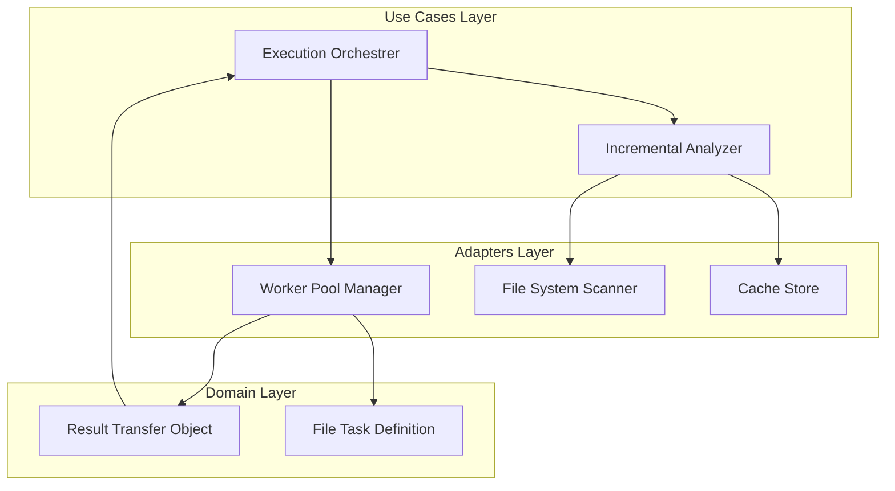

# Design Document: Parallel Execution Runner Logic


## Overview


The Parallel Execution Runner (F3) adopts a 'Fan-Out/Fan-In' architecture designed to maximize resource utilization on multi-core systems. The core philosophy is to minimize wasted cycles through two distinct strategies: first, by narrowing the work set via Incremental Analysis (hashing) to only process changed files; and second, by distributing the remaining tasks across a pool of isolated workers. This approach ensures that performance scales linearly with hardware availability, targeting the sub-60-second validation goal for large repositories.

Architecturally, the system transitions from a single-threaded loop to a decoupled orchestration model. The domain logic (rules) remains pure and agnostic of execution context. The 'Execution Orchestrer' manages the lifecycle, while 'Adapters' handle the complexities of worker communication and file system caching. This separation ensures that the incremental logic can be tested in isolation from the multi-threading logic, promoting a robust and maintainable codebase as requirements for larger scale projects evolve.


## Architecture





## Components and Interfaces


### 1. Execution Orchestrer (`usecases`)


**Path:** `src/usecases/execution_orchestrator.ts`

| Responsibility | Description |
|---|---|
| Coordinating the flow between incremental analysis and parallel execution | |
| Partitioning file lists into balanced worker tasks | |
| Aggregating partial results from workers into a unified report | |


```python
interface ExecutionRequest {
  files: string[];
  rules: Rule[];
  parallelism: number;
}

class ExecutionOrchestrator {
  async execute(req: ExecutionRequest): Promise<Report> {
    const changedFiles = await this.analyzer.getChangedFiles(req.files);
    const tasks = this.partitionWork(changedFiles, req.parallelism);
    const results = await this.workerPool.run(tasks);
    return this.aggregator.combine(results);
  }
}
```


### 2. Incremental Analyzer (`usecases`)


**Path:** `src/usecases/incremental_analyzer.ts`

| Responsibility | Description |
|---|---|
| Computing file hashes for the current workspace | |
| Comparing current state against cached previous state | |
| Pruning the task list to include only modified or new files | |


```python
interface FileHash {
  path: string;
  hash: string;
}

class IncrementalAnalyzer {
  async filterFiles(files: string[]): Promise<string[]> {
    const currentHashes = await this.fs.computeHashes(files);
    const previousHashes = await this.cache.getLatestHashes();
    return files.filter(f => currentHashes[f] !== previousHashes[f]);
  }
}
```


### 3. Worker Pool Manager (`adapters`)


**Path:** `src/adapters/worker_pool.ts`

| Responsibility | Description |
|---|---|
| Managing process/thread lifecycle and resource limits | |
| Serializing and deserializing tasks and results across boundaries | |
| Monitoring worker health and performance metrics | |


```python
interface WorkerTask {
  files: string[];
  ruleIds: string[];
}

class WorkerPool {
  async runTasks(tasks: WorkerTask[]): Promise<LintResult[]> {
    return Promise.all(tasks.map(t => this.dispatchToIdleWorker(t)));
  }
}
```


### 4. Result Aggregator (`usecases`)


**Path:** `src/usecases/result_aggregator.ts`

| Responsibility | Description |
|---|---|
| Merging disparate result arrays into a single structure | |
| Computing global health metrics (e.g., total error density) | |
| Sorting results by severity and file path for consistent reporting | |


```python
class ResultAggregator {
  merge(results: LintResult[][]): FinalReport {
    const flat = results.flat();
    return {
      issues: this.sort(flat),
      summary: this.calculateSummary(flat),
      scannedCount: flat.length,
      timestamp: new Date()
    };
  }
}
```


## Data Models


No new data models are introduced unless specified in the component descriptions above.


## Correctness Properties


*A property is a characteristic or behavior that should hold true across all valid executions of a system — essentially, a formal statement about what the system should do.*


### Property F3-P1: Conservation of Results


*For any execution, the final report's issue count must equal the sum of issues found by all individual workers for the unique set of changed files.*

**Validates: Requirements 3**


### Property F3-P2: Strict Incrementalism


*For any file F, if the hash of F matches the cached hash from the previous run, F shall not be processed by any worker in the parallel pool.*

**Validates: Requirements 2**


### Property F3-P3: Resource Boundary Adherence


*For any machine with N available cores, the system must initialize no more than N-1 workers to prevent OS starvation while maximizing throughput.*

**Validates: Requirements 1**


## Error Handling


| Scenario | Handling |
|---|---|
| A worker process crashes due to an OOM or unexpected rule exception. | The Worker Pool Manager catches the exit code, logs the stack trace from the worker's STDERR, and the Orchestrator marks the specific file batch as 'Failed' in the report without crashing the entire run. |
| The .lint-cache file is corrupted or unreadable. | The Incremental Analyzer defaults to a full scan (clean slate) to ensure safety, logging a warning about the cache corruption. |
| Parallel execution hangs on a specific complex file/rule combination. | The Orchestrator implements a timeout per file; if a rule takes > 10s, it kills the task and reports a 'Performance Timeout' to the aggregator. |


## Testing Strategy


The testing strategy focuses on concurrent correctness and performance benchmarking. We will use 'fast-check' for property-based testing to ensure that different interleavings of file tasks always produce the same aggregated report. Regression testing will involve existing linting test suites, now wrapped in the ExecutionOrchestrator to ensure functional parity with the sequential implementation.

CI verification will include a 'Performance Gate' check using a simulated repo with 1000+ files to verify that the incremental logic results in a >80% reduction in execution time for small changes (Requirement 2). We will use the 'vitest' framework's multi-threading capabilities to simulate diverse core counts.

Configuration:
- Library: fast-check (property testing), vitest (unit/benchmarking)
- Iterations: 100 iterations per property test
- Tag Format: [F3-PARALLEL-CORRECTNESS] for worker integrity tests.
