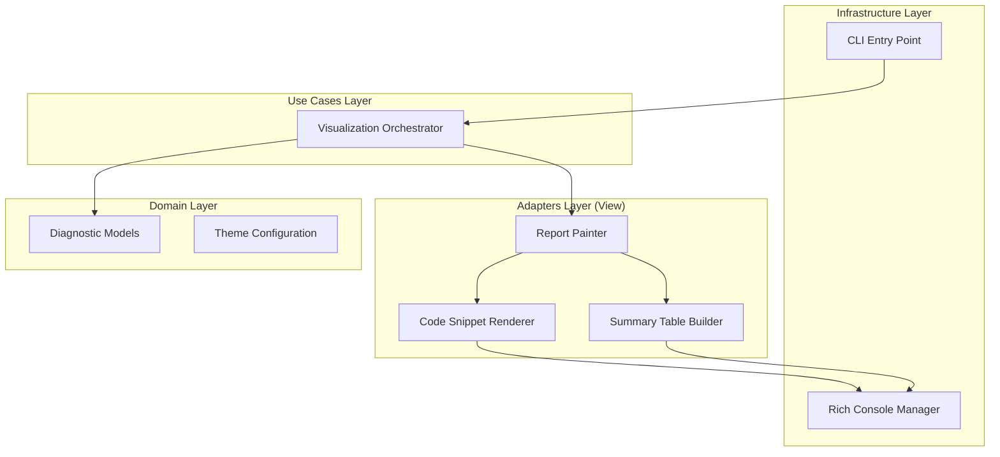

# Design Document: Rich TUI Visualizations


## Overview


The design for 'Rich TUI Visualizations' focuses on transforming the currently sparse CLI output into a high-fidelity, static diagnostic report. The strategy involves integrating the 'Rich' Python library as an adapter to handle complex terminal rendering, including syntax highlighting and table formatting. A key philosophy here is 'High-Fidelity, Zero-Interactivity'; we provide the visual depth of a GUI without the overhead of an interactive loop, ensuring compatibility with CI/CD pipes and standard redirects.

The implementation follows an incremental approach where the existing CLI engine remains unchanged, but its output stream is intercepted by a new 'Visualizer' use case. This Visualizer coordinates several specialized sub-components: a Report Painter for layout, a Snippet Renderer for syntax highlighting, and a Summary Table Builder for categorization. Deep-linking logic is embedded directly into the diagnostic data models, allowing the TUI to generate clickable paths that minimize context-switching for developers.


## Architecture





## Components and Interfaces


### 1. Visualization Orchestrator (`usecases`)


**Path:** `src/usecases/visualizer.py`

| Responsibility | Description |
|---|---|
| Coordinate rendering of diagnostics and tables | |
| Select appropriate rendering strategy based on terminal capabilities | |
| Aggregate diagnostic statistics for the summary table | |


```python
class Visualizer:\n    def render(self, results: List[Diagnostic], output_format: str) -> None:\n        # Orchestrates the painting process\n        pass
```


### 2. Report Painter (`adapters`)


**Path:** `src/adapters/tui/painter.py`

| Responsibility | Description |
|---|---|
| Constructing Rich Table objects for error summaries | |
| Generating Rich Panels for syntax-highlighted code blocks | |
| Generating deep-link URI strings for file navigation | |
| Managing terminal color themes and fallback modes | |


```python
class ReportPainter:\n    def __init__(self, theme: ThemeConfig):\n        self.console = Console(theme=theme)\n\n    def paint_snippet(self, diagnostic: Diagnostic) -> Panel:\n        # Creates a Panel containing highlighted code\n        pass\n\n    def paint_summary(self, stats: DiagnosticStats) -> Table:\n        # Creates the categorized error table\n        pass
```


### 3. Code Snippet Renderer (`adapters`)


**Path:** `src/adapters/tui/snippet_renderer.py`

| Responsibility | Description |
|---|---|
| Reading file fragments with surrounding context | |
| Applying PEP 8 specific highlighting focus to error lines | |
| Calculating column offsets for visual carets (^) | |


```python
def get_highlighted_snippet(\n    file_path: Path, \n    line: int, \n    col: int, \n    context: int = 2\n) -> Syntax:\n    # Returns a Rich Syntax object with highlighted focus\n    pass
```


### 4. Diagnostic Models & Theme Config (`domain`)


**Path:** `src/domain/models.py`

| Responsibility | Description |
|---|---|
| Hold diagnostic data and error categories | |
| Provide deep-link string generation logic | |
| Store user-defined color themes | |


```python
@dataclass(frozen=True)\nclass Diagnostic:\n    code: str\n    message: str\n    file_path: Path\n    line: int\n    col: int\n    category: str # e.g., 'Whitespace', 'Naming', 'Complexity'\n    \n    def get_ide_link(self, editor: str = 'vscode') -> str:\n        # Logic to return f'{editor}://file/{self.file_path}:{self.line}'\n        pass
```


## Data Models


No new data models are introduced unless specified in the component descriptions above.


## Correctness Properties


*A property is a characteristic or behavior that should hold true across all valid executions of a system — essentially, a formal statement about what the system should do.*


### Property F3-P1: Visual Accuracy Invariant


*For any diagnostic output, the line number and column reported in the Snippet Renderer MUST correspond exactly to the coordinates provided by the Diagnostic domain model.*

**Validates: Requirements 1, 4**


### Property F3-P2: Statistical Consistency Invariant


*For any set of diagnostics, the sum of counts in the Categorized Diagnostic Summary Table MUST equal the total count of diagnostics generated by the core engine.*

**Validates: Requirements 2**


### Property F3-P3: Static Output Invariant


*For any execution in a non-interactive terminal environment (TTY=false), the output MUST be a static stream of characters without escape sequence corruption or interactive prompts.*

**Validates: Requirements 3**


## Error Handling


| Scenario | Handling |
|---|---|
| Source file is missing or inaccessible when rendering snippets | The UI will display 'Source unavailable' in the snippet panel if the file was deleted or permissions changed between linting and rendering. |
| Invalid IDE protocol configuration for deep-linking | The system generates a standard file:// link if the user's preferred IDE protocol is unknown or unsupported. |
| Terminal window is too narrow for full table/snippet display | The Report Painter detects the terminal width; if restricted, it prioritizes the error message and truncates the code snippet or summary table columns gracefully. |


## Testing Strategy


The testing strategy focuses on visual regression and statistical accuracy. We will utilize 'Pytest' along with 'Rich's' built-in console capturing tools to verify that the output matches expected ANSI-encoded buffers.

1. **Regression Testing**: Existing integration tests which check for error counts in plain text will be updated to verify the same counts appear within the new 'Summary Table' structure.
2. **Property-Based Testing**: Using Hypothesis, we will generate synthetic diagnostic lists to ensure the 'Statistical Consistency Invariant' (Property #2) holds true regardless of category names or error frequencies.
3. **CI Verification**: Test suites will be run with 'FORCE_COLOR=1' and 'TERM=xterm-256color' to verify high-fidelity rendering, and with 'TERM=dumb' to ensure graceful degradation in restricted environments.
4. **Configuration**: We will use 'pytest-rich' for enhanced test output and a custom 'Snapshot' fixture to store and compare terminal output frames, allowing us to detect unintended layout shifts in the TUI report.
