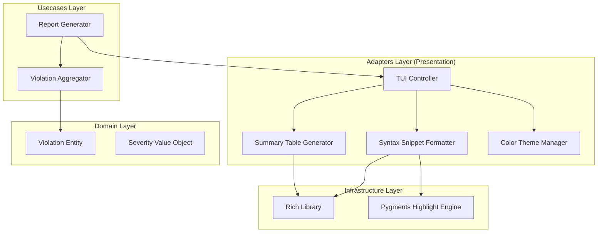

# Design Document: Rich TUI Visualizations


## Overview


The design for F3: Rich TUI Visualizations adopts a 'Linear Enhancement' strategy. Instead of building an interactive terminal application (like Textual), we leverage the 'Rich' library to generate a high-fidelity, static stream of information. This philosophy ensures developers get the visual benefit of an IDE—syntax highlighting, color-coded severity, and structured tables—while maintaining the standard terminal 'scrollback' experience. The system does not attempt to manage an event loop or interactive state, fulfilling the requirement for a static report that persists in the terminal buffer.

At its core, the implementation refactors the existing output pipeline into a dedicated TUI Adapter layer. This layer takes core domain 'Violation' objects and transforms them into visual components: a Summary Diagnostic Table and Syntax Highlighted Snippets. The logic for categorization and severity-level mapping is encapsulated within these components, keeping the core scanning engine clean and focused on detection rather than presentation. This separation allows us to test the visual formatting logic independently of the linting logic.


## Architecture





## Components and Interfaces


### 1. TUI Controller (`adapters`)


**Path:** `src/adapters/tui/controller.py`

| Responsibility | Description |
|---|---|
| Orchestrate the visual flow of the report | |
| Interface with the Rich console singleton | |
| Handle terminal width constraints for responsive wrapping | |


```python
def render_static_report(violations: List[Violation]) -> None:
    \"\"\"Orchestrates the printing of the full report to stdout.\"\"\"
    summary = SummaryTable(violations).build()
    console.print(summary)
    
    for v in violations:
        snippet = CodeSnippet(v).build()
        console.print(snippet)
        console.print(Rule(style=Theme.get_severity_color(v.severity)))
```


### 2. Summary Table Generator (`adapters`)


**Path:** `src/adapters/tui/summary_table.py`

| Responsibility | Description |
|---|---|
| Aggregate violation counts by category and severity | |
| Construct the visual Table structure with headers and footers | |
| Apply color coding to summary cells based on severity thresholds | |


```python
class SummaryTable:
    def __init__(self, violations: List[Violation]):
        self.stats = self._aggregate(violations)
        
    def _aggregate(self, violations: List[Violation]) -> Dict[str, Any]:
        # Returns counts grouped by Category and Severity
        pass

    def build(self) -> rich.table.Table:
        # Returns a configured Rich Table object
        pass
```


### 3. Syntax Snippet Formatter (`adapters`)


**Path:** `src/adapters/tui/snippet.py`

| Responsibility | Description |
|---|---|
| Retrieve raw code lines from disk based on violation coordinates | |
| Apply syntax highlighting using Pygments or Rich highlighters | |
| Construct a visual Panel with file metadata and line numbers | |


```python
class CodeSnippet:
    def __init__(self, violation: Violation, context_lines: int = 3):
        self.v = violation
        self.context = context_lines

    def build(self) -> rich.panel.Panel:
        code = self._get_highlighted_lines()
        return Panel(
            code,
            title=f\"{self.v.file}:{self.v.line}\",
            subtitle=f\"[bold red]{self.v.rule_id}[/]\"
        )
```


### 4. Theme Manager (`adapters`)


**Path:** `src/adapters/tui/theme.py`

| Responsibility | Description |
|---|---|
| Maintain mapping between Domain Severity levels and Terminal Styles | |
| Provide standard color schemes for different violation categories | |


```python
SEVERITY_COLORS = {
    Severity.CRITICAL: \"bold red\",
    Severity.HIGH: \"orange3\",
    Severity.MEDIUM: \"yellow\",
    Severity.LOW: \"blue\",
}

def get_severity_style(severity: Severity) -> str:
    return SEVERITY_COLORS.get(severity, \"white\")
```


### 5. Violation Aggregator (`usecases`)


**Path:** `src/usecases/violation_aggregator.py`

| Responsibility | Description |
|---|---|
| Transform raw violation lists into counts per category/severity pair | |
| Sort violations such that Critical/Security items appear first in the list | |


```python
def aggregate_by_category(violations: List[Violation]) -> Dict[Category, Counter]:
    \"\"\"Groups violations by category and counts their severities.\"\"\"
    pass
```


## Data Models


No new data models are introduced unless specified in the component descriptions above.


## Correctness Properties


*A property is a characteristic or behavior that should hold true across all valid executions of a system — essentially, a formal statement about what the system should do.*


### Property F3-P1: Conservation of Violations


*For any generated Summary Table, the sum of all displayed violation counts must exactly equal the total number of Violation entities in the input list.*

**Validates: Requirements 1.1**


### Property F3-P2: Severity Visual Prominence


*For any Violation with Severity.CRITICAL, the associated UI output (Table row or Code Panel) must contain the ANSI escape sequence for 'bold red' or the designated 'Critical' theme color.*

**Validates: Requirements 3.3**


### Property F3-P3: In-Situ Spatial Accuracy


*For any Code Snippet displayed, the center of the rendered source window must correspond to the line number specified in the Violation entity.*

**Validates: Requirements 2.2**


### Property F3-P4: Pure Static Output Invariant


*For any execution of the report, the TUI Controller must never invoke interactive terminal listeners or 'alternate screen buffer' commands.*

**Validates: Requirements 4.4**


## Error Handling


| Scenario | Handling |
|---|---|
| Source file missing or inaccessible during snippet generation (e.g., file deleted since scan) | The Snippet Formatter falls back to displaying a 'Source file not found' message within the panel, preserving the visual layout while informing the user of the error. |
| Terminal width is too narrow to display the full summary table or code lines. | The TUI Controller detects terminal width and implements 'overflow=fold' for code snippets and 'expand=False' for tables to prevent horizontal scrolling. |
| Pygments or specific language grammar is missing for a file type. | The highlighters default to 'text' mode with basic ANSI coloring for severity, ensuring the report is still readable without syntax beauty. |


## Testing Strategy


The testing strategy for F3 centers on 'Visual Assertion' and 'Aggregation Accuracy'. 

### Regression Testing
We will maintain existing integration tests that verify exit codes and raw JSON output. A mapping layer will be tested to ensure that choosing the '--format tui' flag does not alter the underlying scan results, only their representation.

### CI Verification
The CI pipeline will include a 'Snapshot Test' using the `pytest-rich` or similar library. This will capture the ANSI-encoded output of a sample scan and compare it against a known 'Gold Standard' snapshot. Any changes to the table structure or snippet layout will trigger a failure, requiring a deliberate update to the snapshot.

### New Property-Based Tests
We will use 'Hypothesis' to generate lists of violations with random severities and categories.
- **Aggregation Test**: For any list of violations, the sum of counts in the SummaryTable aggregate must match the input size.
- **Color Consistency Test**: Ensure that every Violation marked 'Critical' in a generated list results in a 'bold red' format string in the rendered output.

### Configuration
Tests will run using the 'Rich' library's `Console(force_terminal=True, width=80)` configuration to ensure consistent snapshots regardless of the CI runner's environment. Iterations for property-based tests will be set to 100 to cover various combinations of severity levels.
