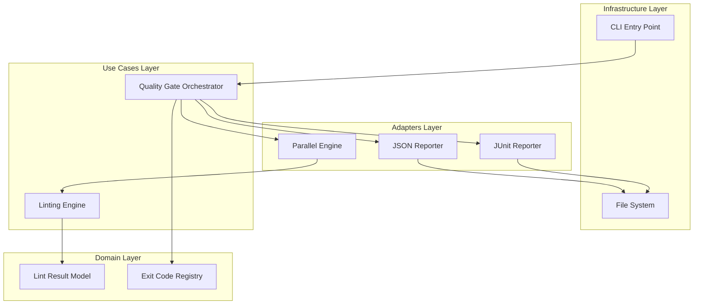

# Design Document: Automated CI/CD Quality Gate


## Overview


The Automated CI/CD Quality Gate (F4) is designed to transform the linter from a local developer tool into a robust policy enforcement engine. The design philosophy centers on 'Predictability and Speed': the tool must provide deterministic exit codes for shell integration and utilize parallelism to ensure that quality checks do not become a bottleneck in the delivery pipeline. 

The approach introduces an Orchestrator layer that decouples the engine's execution from its reporting. We will implement high-performance parallel processing using Node.js worker threads and an incremental processing cache based on file hashes. This allows the system to scale gracefully from small projects to massive monorepos where only changed files are checked during CI runs.

Technically, we are adding machine-readable reporting adapters (JSON/JUnit) while keeping the core Domain Rules intact. The incremental approach involves first standardizing the exit code logic, then adding the serial reporters, and finally introducing the parallel/incremental execution engine as an optimization layer.


## Architecture





## Components and Interfaces


### 1. Quality Gate Orchestrator (`usecases`)


**Path:** `src/usecases/quality_gate.ts`

| Responsibility | Description |
|---|---|
| Coordinate parallel execution across worker threads | |
| Aggregate findings from multiple files | |
| Trigger report generation for multiple formats | |
| Calculate process exit code based on severity thresholds | |


```python
interface QualityGateConfig {
  failOnSeverity: 'error' | 'warning' | 'info';
  outputFormats: Array<'json' | 'junit' | 'console'>;
  outputPath: string;
  parallel: boolean;
}

class QualityGateOrchestrator {
  async run(config: QualityGateConfig): Promise<number>;
}
```


### 2. Parallel Execution Engine (`adapters`)


**Path:** `src/adapters/parallel_engine.ts`

| Responsibility | Description |
|---|---|
| Manage worker thread pool lifecycle | |
| Distribute linting tasks across threads | |
| Collect and merge results from workers | |
| Handle worker crashes or timeouts | |


```python
class ParallelEngine {
  constructor(workerCount: number = os.cpus().length);
  async execute<T, R>(items: T[], task: (item: T) => R): Promise<R[]>;
}
```


### 3. Machine-Readable Reporters (`adapters`)


**Path:** `src/adapters/reporters/`

| Responsibility | Description |
|---|---|
| Serialize LintResults to JSON format | |
| Serialize LintResults to JUnit XML format | |
| Ensure filesystem path safety for output files | |


```python
interface Reporter {
  format(results: LintResult[]): string;
  extension: string;
}

class JUnitReporter implements Reporter {
  format(results: LintResult[]): string {
    // Converts finding to <testcase> with <failure> tags
  }
}
```


### 4. Exit Code Registry (`domain`)


**Path:** `src/domain/exit_codes.ts`

| Responsibility | Description |
|---|---|
| Maintain single source of truth for process exit codes | |
| Map internal exception types to exit codes | |


```python
enum ExitCode {
  SUCCESS = 0,
  LINT_VIOLATIONS_FOUND = 1,
  INTERNAL_ERROR = 2,
  INVALID_CONFIG = 3
}
```


### 5. Incremental Change Detector (`infrastructure`)


**Path:** `src/infrastructure/incremental_cache.ts`

| Responsibility | Description |
|---|---|
| Identify modified files since last run | |
| Manage persistent cache on disk | |
| Verify file hashes to detect changes bypassing Git | |


```python
class IncrementalCache {
  getChangedFiles(sinceHash: string): Promise<string[]>;
  updateCache(file: string, hash: string): void;
}
```


## Data Models


No new data models are introduced unless specified in the component descriptions above.


## Correctness Properties


*A property is a characteristic or behavior that should hold true across all valid executions of a system — essentially, a formal statement about what the system should do.*


### Property F4-P1: Deterministic Exit Codes on Failure


*For any linting execution where findings meet or exceed the 'fail-on' threshold, the process exit code must be exactly 1.*

**Validates: Requirements 1.1**


### Property F4-P2: Report Format Integrity


*For any generated JUnit report, the file must be valid XML according to the JUnit XSD and contain entry counts equal to the total findings count.*

**Validates: Requirements 2.1**


### Property F4-P3: Parallel Performance Benefit


*For any execution with 'parallel' enabled on N files, the wall-clock time must be less than the sequential execution time for N > 100, assuming N > CPU Cores.*

**Validates: Requirements 3.1**


## Error Handling


| Scenario | Handling |
|---|---|
| Worker thread crashes during parallel execution | Terminate non-crashed workers, aggregate errors from crashed workers, and exit with code 2 to indicate system failure. |
| Output directory for reports is not writable | Catch I/O exceptions, log a human-readable message to stderr, and exit with code 2. Ensure previous report parts are cleaned up. |
| Conflict between '--fail-on' and internal severity levels | Validate CLI flags using a schema; if invalid, print usage instructions and exit with code 3 (Invalid Config). |


## Testing Strategy


Our testing strategy focuses on CI integration reliability. We will use a combination of Integration Tests and Property-Based Tests (PBT).

1. Regression Testing: We will run the existing rule test suite through the new Orchestrator to ensure that output-layer changes haven't altered the detection logic.

2. CI Verification: We will use a 'meta-pipeline' to verify exit codes. A shell script will execute the linter against 'known-fail' and 'known-pass' directories and assert the $? status.
   - Command: `npm run build && test_exit_codes.sh`

3. Property-Based Tests (fast-check): We will generate large sets of synthetic findings and verify that the JUnit reporter produces valid XML and that the parallel engine results exactly match the sequential engine results.
   - Iterations: 100
   - Tag: `[CI-INTEGRATION]`

4. Performance Benchmarks: A specialized CI job will run the linter on the codebase itself in both serial and parallel modes, asserting a minimum 2x speedup on 4+ core runners.
