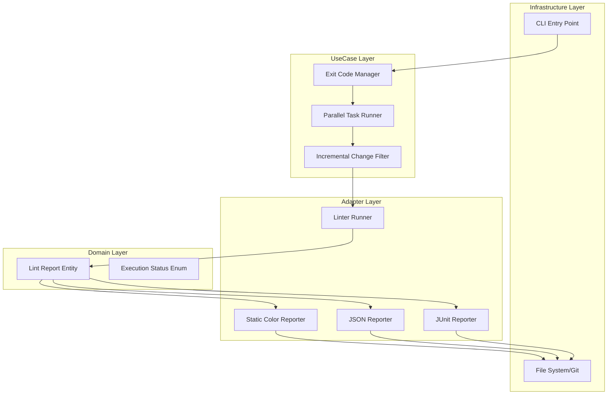

# Design Document: Automated CI/CD Quality Gate


## Overview


The Automated CI/CD Quality Gate feature focuses on transforming the linter from a desktop tool into a robust pipeline primitive. The strategy centers on 'Determinism and Observability': ensuring the tool behaves predictably in non-interactive environments while providing rich, structured data for downstream systems. We will introduce a strict separation between the linting core and the reporting/exit-code logic to ensure that CI-specific requirements don't leak into the domain rules.

The implementation follows an incremental approach. First, we standardize the internal Result models to support status codes. Second, we implement a multi-formatter system that allows simultaneous output to stdout (for human logs) and files (for machine data). Finally, we introduce the ParallelExecutor using Python's 'multiprocessing' or 'asyncio' patterns to maximize throughput on multi-core CI runners. What stays the same is the core rule evaluation logic; what changes is how the results of those evaluations are aggregated, reported, and signaled to the parent process.


## Architecture





## Components and Interfaces


### 1. Exit Code Manager (`usecases`)


**Path:** `src/usecases/exit_manager.py`

| Responsibility | Description |
|---|---|
| Map lint results to standardized integer exit codes | |
| Handle 'strict' mode overrides for warnings | |
| Interface with process exit signals | |


```python
class ExitCodeManager:
    EXIT_CODES = {
        "SUCCESS": 0,
        "VIOLATIONS_FOUND": 1,
        "CONFIGURATION_ERROR": 2,
        "SYSTEM_FAULT": 3
    }

    def determine_exit_code(self, report: LintReport, strict: bool) -> int:
        if report.has_errors:
            return self.EXIT_CODES["VIOLATIONS_FOUND"]
        ...
```


### 2. Parallel Task Runner (`usecases`)


**Path:** `src/usecases/parallel_executor.py`

| Responsibility | Description |
|---|---|
| Distribute linting tasks across CPU cores | |
| Aggregate results from parallel workers | |
| Manage worker life-cycle and memory limits | |


```python
class ParallelExecutor:
    def __init__(self, max_workers: int):
        self.pool = ProcessPoolExecutor(max_workers=max_workers)

    async def run_parallel(self, files: List[Path], rule_engine: Callable) -> List[Issue]:
        chunks = self.partition_files(files)
        results = await asyncio.gather(*[self.run_chunk(c) for c in chunks])
        return flatten(results)
```


### 3. Machine-Readable Reporters (`adapters`)


**Path:** `src/adapters/reporters.py`

| Responsibility | Description |
|---|---|
| Serialize LintReport entities into JSON/XML/ANSI formats | |
| Ensure compatibility with JUnit XSD for CI integration | |
| Handle file I/O for report persistence | |


```python
class IReporter(Protocol):
    def format(self, report: LintReport) -> str: ...

class JUnitReporter(IReporter):
    def format(self, report: LintReport) -> str:
        # Returns XML structured string compatible with JUnit schema
        pass

class ConsoleReporter(IReporter):
    def format(self, report: LintReport) -> str:
        # Returns colorized string for TTY
        pass
```


## Data Models


No new data models are introduced unless specified in the component descriptions above.


## Correctness Properties


*A property is a characteristic or behavior that should hold true across all valid executions of a system — essentially, a formal statement about what the system should do.*


### Property F4-P1: Standardized Exit Invariant


*For any linting execution, the process must return exit code 1 if and only if the number of detected 'Error' severity violations is greater than zero, unless overridden by configuration.*

**Validates: Requirements 1.1**


### Property F4-P2: Report Format Integrity


*For any generated JSON report, the output must be valid according to the RFC 8259 specification and contain keys for 'summary', 'files', and 'timestamp'.*

**Validates: Requirements 2.1**


### Property F4-P3: Concurrency Determinism


*For any set of files F, the set of issues detected in a parallel execution must be identical to the set of issues detected in a sequential execution.*

**Validates: Requirements 3.1**


## Error Handling


| Scenario | Handling |
|---|---|
| LLM Provider API Timeout or Network Failure during CI run | Catch exception, log 'System Error' with red ANSI formatting to stderr, and return Exit Code 3. |
| Invalid configuration file provided in CI environment | Validate config at startup; if invalid, print schema errors and return Exit Code 2. |
| Resource depletion (Out of Memory) during parallel execution worker spawn | Automatically fallback to sequential execution and log a warning; do not fail the build. |


## Testing Strategy


The testing strategy focuses on environment simulation and property-based verification. Regression testing will utilize a suite of 'Golden Master' files where both the output content (JSON/JUnit) and the process exit code are compared against known-good benchmarks to prevent drift. CI verification will be handled via a dedicated GitHub Action workflow that runs the linter against a 'Broken Repository' fixture, asserting that the pipeline fails with the expected code 1.

New property-based tests will be implemented using the 'Hypothesis' library. These tests will generate random file structures and rule configurations to ensure that the ParallelExecutor always produces the same outcome as the SequentialExecutor, and that the JUnit reporter always produces valid XML regardless of the characters found in the linted code. We will also perform 'Log Staticity' tests, ensuring that when the TTY is disabled (as in most CI logs), the tool suppresses interactive elements like progress bars in favor of static, append-only logs. Test execution will be tagged with '@ci-gate' and run with 100 iterations per property.
