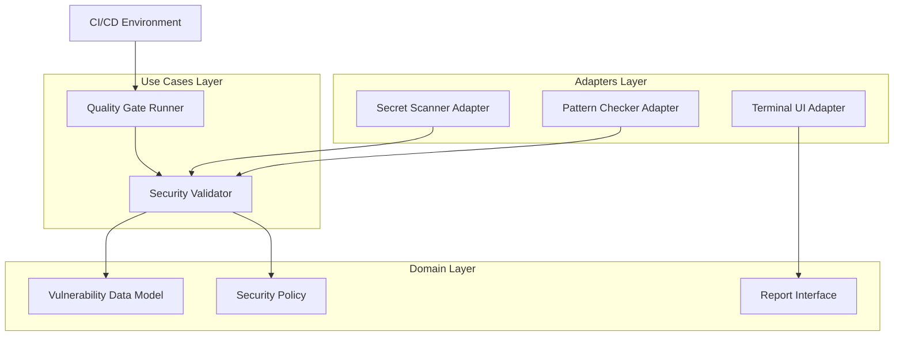

# Design Document: Security Vulnerability Guard


## Overview


The Security Vulnerability Guard is designed as an extensible multi-engine scanning system integrated into the existing linter pipeline. It adopts a 'Deep Scan' strategy, combining regex-based entropy analysis for secret detection with AST-based pattern matching for insecure library usage (like 'pickle' or 'unsafe-yaml') and SQL injection risks. The core philosophy is 'Security as DX', where vulnerabilities are presented not as dry logs, but as actionable, color-coded components in the terminal that point directly to the offending code and provide remediation hints.

The architecture introduces a specialized 'SecurityValidator' use case that runs parallel to standard linting. While the parser and file-walking infrastructure remain unchanged, we add a new Quality Gate layer. This layer is specifically designed for CI/CD environments to enforce strict exit codes based on vulnerability severity. Incremental deployment starts with secret detection, followed by pattern-based scanning for libraries and SQL injection, ensuring each engine can be tuned independently for false-positive reduction.


## Architecture





## Components and Interfaces


### 1. Security Validator (`usecases`)


**Path:** `src/usecases/security_validator.py`

| Responsibility | Description |
|---|---|
| Coordinate multiple scanning engines (Secrets, SQLi, Libraries) | |
| Aggregate vulnerability findings into a unified report | |
| Filter findings based on project-specific security ignore-lists | |


```python
class SecurityScanner(Protocol):
    def scan(self, context: ScanContext) -> List[Vulnerability]: ...

class SecurityValidator:
    def __init__(self, scanners: List[SecurityScanner]):
        self.scanners = scanners

    def validate_codebase(self, path: Path) -> SecurityReport:
        # Orchestrates parallel scanning across all registered engines
        pass
```


### 2. Quality Gate Runner (`usecases`)


**Path:** `src/usecases/quality_gate.py`

| Responsibility | Description |
|---|---|
| Enforce a zero-tolerance policy for critical vulnerabilities in CI/CD | |
| Determine exit codes based on security severity thresholds | |
| Provide summary metrics for pipeline logs | |


```python
class QualityGate:
    def evaluate(self, report: SecurityReport) -> GateResult:
        is_blocked = any(v.severity == Severity.CRITICAL for v in report.findings)
        return GateResult(status=GateStatus.FAIL if is_blocked else GateStatus.PASS)
```


### 3. Visual Security Reporter (`adapters`)


**Path:** `src/adapters/tui_reporter.py`

| Responsibility | Description |
|---|---|
| Render high-fidelity vulnerability tables to the terminal | |
| Highlight code snippets containing security flaws | |
| Provide color-coded severity indicators for fast visual parsing | |


```python
class SecurityTUI:
    def render_vulnerabilities(self, report: SecurityReport) -> None:
        # Uses rich-text library to build tables and syntax-highlighted code blocks
        for finding in report.findings:
            self.console.print(Panel(finding.snippet, title=finding.message, style=finding.severity.color))
```


## Data Models


No new data models are introduced unless specified in the component descriptions above.


## Correctness Properties


*A property is a characteristic or behavior that should hold true across all valid executions of a system — essentially, a formal statement about what the system should do.*


### Property F4-P1: Critical Vulnerability Blockade


*For any SecurityReport containing at least one finding with Severity.CRITICAL, the QualityGate.evaluate result must be GateStatus.FAIL.*

**Validates: Requirements 3**


### Property F4-P2: Secret Masking Invariants


*For any secret identified by the SecretScanner, the resulting Vulnerability object must mask the secret value in the TUI output.*

**Validates: Requirements 1, 4**


### Property F4-P3: Pattern Detection Coverage


*For any codebase containing known SQL injection patterns (e.g., f-string SQL queries), the PatternChecker must return at least one vulnerability of type SQL_INJECTION.*

**Validates: Requirements 2**


## Error Handling


| Scenario | Handling |
|---|---|
| Scanning engine encounters a file that exceeds the complexity threshold for regex/AST analysis. | The scanner reports a TimeoutVulnerability for that file and continues scanning others; the quality gate treats timeouts as FAIL to ensure security isn't bypassed by obfuscation. |
| Security policy configuration file (e.g., .security.yaml) is corrupted or has invalid syntax. | The SecurityValidator falls back to a default 'Safe' policy and logs a warning, but still performs basic secret scanning. |


## Testing Strategy


The testing strategy employs a tiered approach. Regression testing will utilize the existing 'linter-smoke-tests' suite to ensure that adding security scans doesn't degrade performance for standard linting tasks. CI verification will be handled via a dedicated GitHub Action workflow that runs 'bin/linter scan --security-only' against a 'vulnerable-samples' directory, expecting a non-zero exit code.

New property-based tests will be implemented using the Hypothesis library. These tests will generate random code strings containing variations of secrets (AWS keys, SSH keys) and SQL injection patterns to verify that the scanners maintain an 100% detection rate for critical patterns regardless of surrounding white space or comments. Property tests will run for 1000 iterations per engine. Configuration will use the '@security' tag in the test suite to allow developers to run security-specific tests independently of the full suite.
