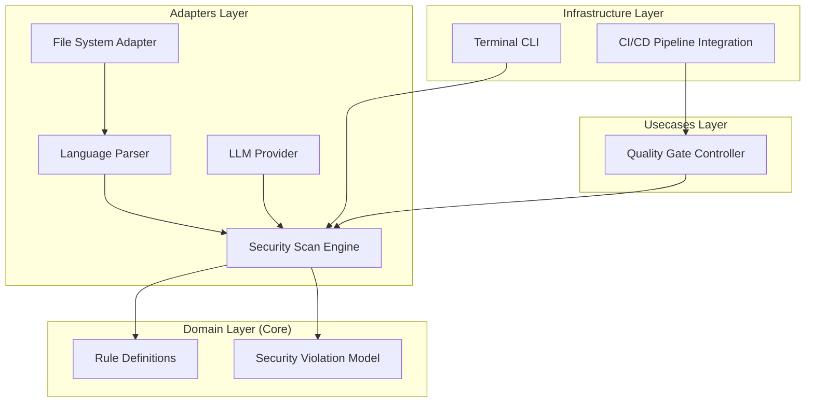

# Design Document: Security Vulnerability Guard


## Overview


The Security Vulnerability Guard is designed as an AST-based static analysis extension to the existing linter. The strategy shifts from simple regex-based linting to semantic analysis, allowing the tool to distinguish between safe string literals and dangerous SQL injection sinks or hardcoded credentials. The core philosophy is 'Fail Fast, Fail Secure,' ensuring that the most critical leaks are blocked at the developer's terminal and reinforced in the CI/CD pipeline.

We introduce a parallel execution model using a worker-pool pattern to handle large-scale monorepos or multi-project environments without impacting developer velocity. While the CLI structure and file-walking logic remain largely unchanged, we introduce a new 'Security Engine' use case that orchestrates specialized analyzers (SQLi, Secret, Library). This incremental approach leverages existing infrastructure while adding a robust security-specific layer.


## Architecture





## Components and Interfaces


### 1. Security Scan Engine (`usecases`)


**Path:** `src/usecases/security_scan_engine.py`

| Responsibility | Description |
|---|---|
| Orchestrate parallel scanning of multiple projects [E8] | |
| Aggregate violations from disparate analyzers | |
| Apply security rules to parsed code structures | |


```python
class SecurityScanEngine:
    def __init__(self, analyzers: List[ISecurityAnalyzer]):
        self.analyzers = analyzers

    async def scan_project(self, project_path: str) -> List[SecurityViolation]:
        # Implementation uses asyncio.gather for parallel project scanning
        pass

class ISecurityAnalyzer(Protocol):
    def analyze(self, tree: AST, context: ScanContext) -> List[SecurityViolation]:
        ...
```


### 2. Quality Gate Controller (`usecases`)


**Path:** `src/usecases/quality_gate_controller.py`

| Responsibility | Description |
|---|---|
| Enforce security thresholds for CI/CD [E7][E25] | |
| Categorize violations by severity level | |
| Determine build pass/fail status [E4] | |


```python
class QualityGateController:
    def evaluate(self, violations: List[SecurityViolation]) -> GateStatus:
        critical_vulnerabilities = [v for v in violations if v.severity == Severity.CRITICAL]
        if critical_vulnerabilities:
            return GateStatus.BLOCK
        return GateStatus.PASS
```


### 3. Security Pattern Matcher (`adapters`)


**Path:** `src/adapters/pattern_matcher.py`

| Responsibility | Description |
|---|---|
| Detect hardcoded credentials using entropy checks [E3] | |
| Identify insecure serialization methods [E9] | |
| Identify SQL injection patterns in database queries [E8] | |


```python
class SQLIAnalyzer(ISecurityAnalyzer):
    def analyze(self, tree: AST, context: ScanContext) -> List[SecurityViolation]:
        # Detects patterns like: cursor.execute(f"SELECT * FROM users WHERE id = {user_id}")
        pass

class CredentialAnalyzer(ISecurityAnalyzer):
    def analyze(self, tree: AST, context: ScanContext) -> List[SecurityViolation]:
        # Detects high-entropy strings assigned to variables like 'API_KEY'
        pass
```


## Data Models


No new data models are introduced unless specified in the component descriptions above.


## Correctness Properties


*A property is a characteristic or behavior that should hold true across all valid executions of a system — essentially, a formal statement about what the system should do.*


### Property F4-P1: Credential Leak Prevention


*For any input source code containing a hardcoded string with entropy > 4.5 assigned to a variable named 'KEY' or 'SECRET', the engine must return a Critical Severity Violation.*

**Validates: Requirements 1.1, 1.4**


### Property F4-P2: Parallel Execution Efficiency


*For any set of 50 projects processed concurrently, the total execution time must be less than the linear sum of individual project scan times, utilizing available CPU cores.*

**Validates: Requirements 1.3**


### Property F4-P3: Security Gate Enforcement


*For any scan result containing a 'Critical' severity violation, the Quality Gate Controller must return a 'BLOCK' status.*

**Validates: Requirements 1.4**


## Error Handling


| Scenario | Handling |
|---|---|
| Syntax error in one of the 50 projects prevents AST parsing. | The specific project scan is marked as 'FAILED' in the aggregate report, but the engine continues scanning other projects to ensure maximum coverage. |
| External vulnerability database is unreachable. | The engine falls back to local AST-based detection and logs a warning; it does not block the build unless configured for 'Strict' mode. |


## Testing Strategy


The testing strategy combines traditional unit tests for analyzers with Property-Based Testing (PBT) using the Hypothesis library to ensure the SQLi and Credential detectors are robust. We will generate 1,000+ variations of code strings (varying entropy, nesting levels, and variable naming) to verify that the 'Secret' detector does not miss edge cases.

For regression, we will use a suite of 'Known Vulnerable' code snippets (DamnvulnerableApp samples) to ensure 100% recall. Parallelism will be verified using integration tests that scan 50 mocked projects, asserting that the execution time meets target benchmarks. CI verification will run 'pytest -n auto' to simulate multi-core environments, with a specific focus on the Quality Gate's exit codes.
