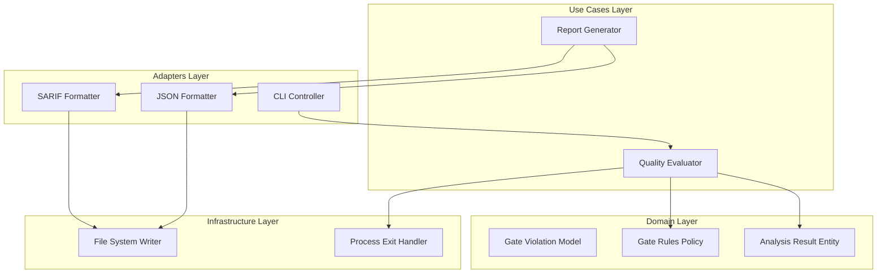

# Design Document: Automated Quality Gate Logic


## Overview


The design for F5 focuses on transforming the CLI from a passive reporting tool into an active enforcement engine for CI/CD pipelines. This is achieved by introducing a 'Quality Gate' layer that intercepts analysis results and evaluates them against user-defined severity thresholds. The strategy follows an 'Enforce-Then-Export' philosophy, ensuring that even if a report generation fails, the exit code accurately reflects the security posture of the scanned code.

Architecturally, we introduce the Strategy pattern for report formatting to decouple the domain results from specific export schemas like SARIF and JSON. The core analysis logic remains unchanged, but a new evaluation use case is added to synthesize raw scan data into a binary pass/fail decision. This allows for incremental adoption where users can first enable JSON exports and later configure strict exit codes as their pipeline maturity grows.


## Architecture





## Components and Interfaces


### 1. Quality Evaluator (`usecases`)


**Path:** `src/usecases/quality_evaluator.py`

| Responsibility | Description |
|---|---|
| Aggregate analysis results across multiple files | |
| Apply severity threshold filtering logic | |
| Determine final pass/fail status for the CI environment | |
| Map domain violations to exit code requirements | |


```python
class QualityEvaluator:
    def evaluate(self, result: AnalysisResult, rules: GateRules) -> EvaluationReport:
        # Returns decision and blocking list
        pass

class GateRules(BaseModel):
    fail_on_severity: SeverityLevel = SeverityLevel.CRITICAL
    fail_on_count: int = 1
    excluded_rules: List[str] = []
```


### 2. Machine-Readable Exporters (`adapters`)


**Path:** `src/adapters/report_exporter.py`

| Responsibility | Description |
|---|---|
| Serialize internal Violation objects to SARIF 2.1.0 | |
| Serialize internal Violation objects to JSON format | |
| Manage file I/O operations for export paths | |
| Ensure schema compliance for external tools | |


```python
interface IReportFormatter:
    def format(self, results: List[Violation]) -> str

class SarifFormatter(IReportFormatter):
    def format(self, results: List[Violation]) -> str:
        # Implementation of SARIF 2.1.0 schema
        pass

class JsonFormatter(IReportFormatter):
    def format(self, results: List[Violation]) -> str:
        # Native JSON serialization
        pass
```


### 3. CLI Termination Controller (`infrastructure`)


**Path:** `src/infrastructure/cli_controller.py`

| Responsibility | Description |
|---|---|
| Map evaluation failure to specific OS exit codes | |
| Orchestrate the flow from scan to export to exit | |
| Handle configuration overrides for gate thresholds | |


```python
def run_pipeline(config: CLIConfig):
    results = analyzer.scan()
    report = evaluator.evaluate(results, config.gate_rules)
    exporter.write(results, config.export_format)
    
    if report.failed:
        sys.exit(config.failure_exit_code)
    sys.exit(0)
```


## Data Models


No new data models are introduced unless specified in the component descriptions above.


## Correctness Properties


*A property is a characteristic or behavior that should hold true across all valid executions of a system — essentially, a formal statement about what the system should do.*


### Property F5-P1: Threshold Enforcement Invariant


*For any AnalysisResult containing at least one Violation with severity >= gate_rules.fail_on_severity, the QualityEvaluator output must have 'failed' set to True.*

**Validates: Requirements 3**


### Property F5-P2: Termination Consistency


*For any execution where QualityEvaluator output 'failed' is True, the CLI process must terminate with the user-defined non-zero exit code.*

**Validates: Requirements 1**


### Property F5-P3: Schema Compliance


*For any SarifFormatter output, the resulting string must validate against the official SARIF 2.1.0 JSON Schema.*

**Validates: Requirements 2**


## Error Handling


| Scenario | Handling |
|---|---|
| Invalid severity threshold provided in configuration (e.g., 'URGENT' instead of 'CRITICAL') | Log warning, default to pass/fail based on 'strict' config mode, and continue to exit normally. |
| Report export directory is not writable during CI execution | Catch I/O error, notify user via stderr, but preserve the calculated exit code based on the Quality Gate logic. |


## Testing Strategy


The testing strategy focuses on automated gate verification and schema validation. 

Regression Testing: Existing unit tests for scan logic will be run to ensure no regressions in detection capabilities.

CI Verification:
- Run 'pytest tests/integration/test_quality_gates.py'
- Validate exit codes using 'mock-shell-check' utility.

Property-Based Testing:
Using 'hypothesis', we will generate arbitrary lists of Violations with varying severities and verify that for any list where severity >= threshold, the gate evaluator consistently returns failure.

Configuration:
- Library: pytest, hypothesis
- Iterations: 1000 for property-based tests
- Tags: @quality-gate, @sarif-compliance
