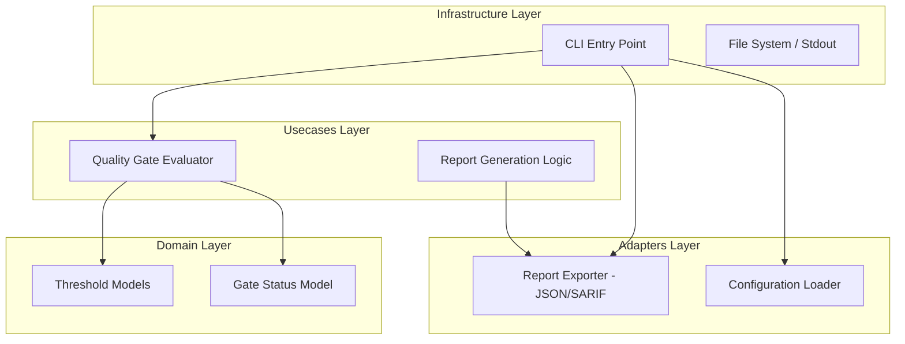

# Design Document: Automated Quality Gate Logic


## Overview


The Automated Quality Gate Logic feature transitions PyVisualGuard from a purely interactive TUI tool to a CI-ready security scanner. The strategy is to decouple the evaluation of 'pass/fail' from the detection of vulnerabilities. We introduce a GateEvaluator that processes raw findings against a ThresholdConfig, allowing users to define exactly what constitutes a 'breaking' build. This approach ensures that the scanning engine remains focused on detection, while the gate logic focuses on policy enforcement.

Architecturally, we are adding new Adapters for standardized reporting (JSON and SARIF) and updating the Infrastructure (CLI) to support non-zero exit codes. The existing TUI logic remains untouched and will simply ignore the exit code logic in interactive mode. The incremental change focuses on the CLI interface, providing a machine-machine communication channel that bypasses the human-centric TUI when output flags or thresholds are detected.


## Architecture





## Components and Interfaces


### 1. Quality Gate Evaluator (`usecases`)


**Path:** `src/usecases/gate_evaluator.py`

| Responsibility | Description |
|---|---|
| Aggregate findings by severity level | |
| Compare counts against maximum allowable thresholds | |
| Determine final pass/fail status and exit code recommendation | |


```python
class QualityGateEvaluator:
    def evaluate(self, findings: List[Finding], config: ThresholdConfig) -> GateResult:
        ...
        
class ThresholdConfig(BaseModel):
    max_critical: int = 0
    max_high: int = 0
    fail_on_severity: Severity = Severity.CRITICAL
```


### 2. Format Exporter (`adapters`)


**Path:** `src/adapters/report_exporter.py`

| Responsibility | Description |
|---|---|
| Serialize findings to JSON format | |
| Map internal findings to SARIF schema | |
| Write report files to disk safely | |


```python
class IReportExporter(Protocol):
    def export(self, findings: List[Finding], result: GateResult, path: Path) -> None:
        ...

class SarifExporter(IReportExporter):
    def _map_to_sarif_rule(self, finding: Finding) -> dict:
        ...
```


### 3. CLI Orchestrator (`infrastructure`)


**Path:** `src/infrastructure/cli.py`

| Responsibility | Description |
|---|---|
| Parse command line arguments for thresholds and formats | |
| Execute scan and evaluation workflow | |
| Terminate process with correct exit codes | |


```python
@app.command()
def scan(
    path: Path,
    json: bool = False,
    sarif: Optional[Path] = None,
    fail_on: Severity = Severity.CRITICAL
):
    findings = engine.run(path)
    gate_result = evaluator.evaluate(findings, config)
    
    if sarif:
        exporter.export(findings, gate_result, sarif)
        
    if gate_result.failed:
        sys.exit(gate_result.exit_code)
```


## Data Models


No new data models are introduced unless specified in the component descriptions above.


## Correctness Properties


*A property is a characteristic or behavior that should hold true across all valid executions of a system — essentially, a formal statement about what the system should do.*


### Property F5-P1: Threshold Violation Exit Code Consistency


*For any scan execution, if the number of findings at a specific severity level exceeds the configured threshold, the process exit code must be non-zero.*

**Validates: Requirements E4, E7, E25**


### Property F5-P2: SARIF Schema Compliance


*For any output generated with the SARIF flag, the resulting file must validate against the official SARIF v2.1.0 JSON schema.*

**Validates: Requirements E10, E25**


### Property F5-P3: Negative Gate Integrity


*For any scan where the findings count is below all configured thresholds, the exit code must be 0 and the JSON output must record a 'pass' status.*

**Validates: Requirements Requirement 3**


## Error Handling


| Scenario | Handling |
|---|---|
| User provides an invalid path for the JSON/SARIF output file (e.g., no write permissions). | Display clear error message and exit with code 1 (Standard Error) rather than the Gate Error code. |
| Malformed configuration file provided for threshold settings. | Default to 'Critical' severity threshold and issue a warning if the scan continues. |


## Testing Strategy


The testing strategy utilizes a mix of integration tests and property-based testing. We will use 'pytest' for execution and 'Hypothesis' for property-based tests to ensure thresholds are correctly calculated across arbitrary finding counts. 

1. Regression Testing: Run existing TUI-based tests to ensure that interactive behavior is not affected by the new exit code logic.
2. CI Verification: A specific 'pipeline-simulation' test suite will execute the CLI against a matrix of repositories and thresholds, asserting that the '$?' shell variable matches expected gate outcomes.
3. Property-Based Tests: We will define properties where 'For any finding set S and threshold T, if size(S_critical) > T, exit_code != 0'. Hypothesis will be configured with 200 iterations per test to explore edge cases in threshold boundaries.
4. Configuration: Tests will use the '@pytest.mark.gate' tag for filtering. Output validation for SARIF will be performed using the 'jsonschema' library against the official v2.1.0 specification.
