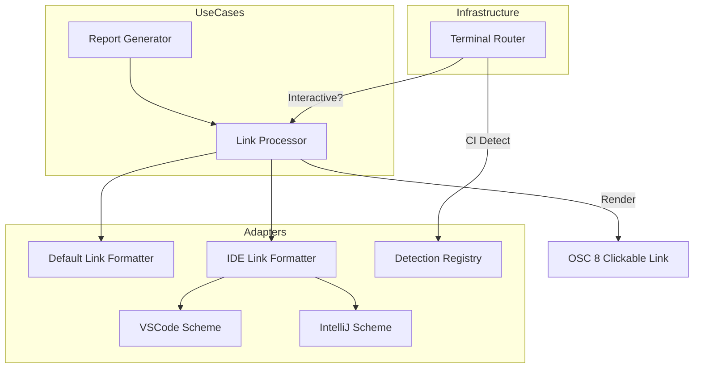

# Design Document: IDE Deep-Linking Integration


## Overview


The IDE Deep-Linking Integration focuses on enhancing the developer experience by transforming static file paths into interactive elements within the terminal. The core strategy utilizes the OSC 8 (Office Standard Command 8) terminal sequence, which allows for 'hyperlinking' text similarly to HTML but within a CLI context. This approach keeps the visual output clean—displaying only the file path—while embedding the metadata needed for IDE navigation.

Architecturally, we introduce a LinkProvider adapter that sits between the Report Generator and the Output Stream. This provider is environment-aware: it detects if the tool is running in a local interactive terminal (like VSCode, iTerm2, or IntelliJ) or in a headless CI/CD environment. In CI environments, the system automatically degrades to plain text to prevent log corruption, while in local environments, it constructs IDE-specific URIs (e.g., vscode://) to enable line-jumping. The existing reporting logic remains unchanged, as the linking logic is injected as a formatting decorator.


## Architecture





## Components and Interfaces


### 1. LinkProvider (`adapters`)


**Path:** `src/adapters/links/link_provider.py`

| Responsibility | Description |
|---|---|
| Detect terminal interactive capabilities | |
| Map file paths to IDE-specific URI schemes | |
| Construct OSC 8 escape sequences for terminal output | |
| Fallback to plain text for non-interactive environments | |


```python
class ILinkFormatter(Protocol):
    def format(self, path: str, line: int, col: int) -> str: ...

class LinkProvider:
    def __init__(self, formatter: ILinkFormatter):
        self._formatter = formatter

    def wrap(self, text: str, path: str, line: int = 1) -> str:
        uri = self._formatter.format(path, line, 0)
        return f"\033]8;;{uri}\033\\{text}\033]8;;\033\\"
```


### 2. EnvironmentDetector (`infrastructure`)


**Path:** `src/infrastructure/env/detector.py`

| Responsibility | Description |
|---|---|
| Identify if the process is running in a CI environment | |
| Determine the host IDE if executed within an integrated terminal | |
| Verify TTY availability for interactive link rendering | |


```python
class TerminalEnv:
    is_interactive: bool
    supports_osc8: bool
    detected_ide: Optional[str]

def detect_environment() -> TerminalEnv:
    # Logic to check CI env vars and TTY status
    ...
```


## Data Models


No new data models are introduced unless specified in the component descriptions above.


## Correctness Properties


*A property is a characteristic or behavior that should hold true across all valid executions of a system — essentially, a formal statement about what the system should do.*


### Property F5-P1: CI Transparency Invariant


*For any output generated in a non-interactive environment (CI=true), the resulting string must contain zero OSC 8 escape sequences.*

**Validates: Requirements 1.3**


### Property F5-P2: Line-Jump Precision


*For any rendered link in a supported IDE terminal, the OSC 8 URI must include the exact line number provided by the security auditor.*

**Validates: Requirements 1.2**


## Error Handling


| Scenario | Handling |
|---|---|
| IDE detection fails in a local interactive terminal. | Revert to standard file:// URI if no IDE is detected and OSC 8 is supported. |
| Output is redirected to a pipe or static file. | Strip all escape sequences and return the raw file path string. |


## Testing Strategy


The testing strategy relies on environment simulation and property-based verification. Regression testing will involve running the existing report suite with a 'MockTerminal' to ensure that standard output formatting is not regressed when linking is disabled.

For CI verification, we will use a test job that sets 'CI=true' and asserts that no ANSI 033 sequences are present in the 'stdout' capture. 

New property-based tests using the 'Hypothesis' library will generate various file paths (including those with spaces and special characters) and line numbers to ensure that the generated URIs remain RFC 3986 compliant and correctly formatted for VSCode and IntelliJ schemes. We will target 100 iterations per formatter type. Configuration for these tests will be handled via a 'pytest' mark 'deep_link' to allow isolation from quick unit tests.
