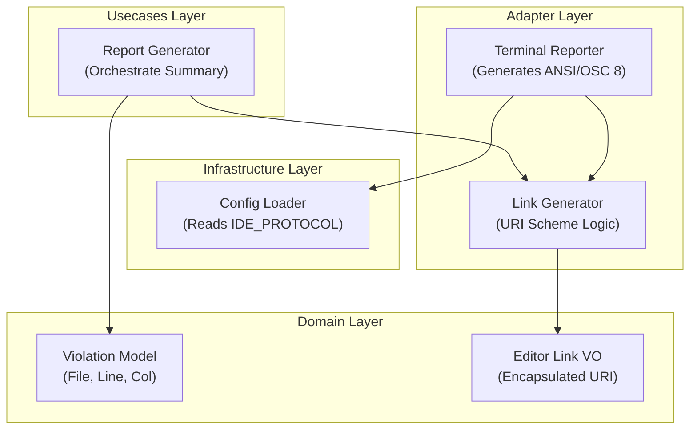

# Design Document: IDE Deep-Linking Integration


## Overview


The IDE Deep-Linking Integration follows a strategy of 'Invisible Enhancement'. The core linting logic and internal data models remain largely untouched, while the presentation layer is upgraded to emit OSC 8 escape sequences. This approach allows users in modern terminals (iTerm2, VS Code, Alacritty) to click file paths and jump directly to the code, while maintaining backward compatibility for legacy environments that will simply see standard text.

The strategy centers on the 'Link Generator' adapter, which translates internal violation coordinates into URI schemes like 'vscode://' or 'cursor://'. By modularizing the URI construction, we support various IDEs via configuration. The existing summary table remains the visual anchor, but its 'Location' column becomes an interactive gateway to the code, directly addressing the need for an aesthetics-driven, efficient workflow.


## Architecture





## Components and Interfaces


### 1. IDE Link Generator (`adapters`)


**Path:** `src/adapters/link_generator.py`

| Responsibility | Description |
|---|---|
| Map file paths and coordinates to IDE-compatible URI schemes | |
| Construct OSC 8 escape sequences for terminal emulators | |
| Sanitize file paths for URI safety | |


```python
class LinkGenerator:
    def generate_osc8_link(self, path: str, line: int, col: int) -> str:
        uri = self._build_ide_uri(path, line, col)
        return f"\033]8;;{uri}\033\\{path}:{line}:{col}\033]8;;\033\\"
    
    def _build_ide_uri(self, path: str, line: int, col: int) -> str:
        # Example: vscode://file/{abs_path}:{line}:{col}
        ...
```


### 2. Enhanced Terminal Reporter (`adapters`)


**Path:** `src/adapters/terminal_reporter.py`

| Responsibility | Description |
|---|---|
| Render the final color-coded summary table | |
| Inject OSC 8 links into the 'Location' column | |
| Maintain visual layout across different terminal widths | |


```python
class TerminalReporter:
    def render_summary_table(self, violations: List[Violation]):
        table = Table(title="Linting Violations")
        for v in violations:
            link = self.link_gen.generate_osc8_link(v.path, v.line, v.col)
            table.add_row(v.category, link, v.message)
        self.console.print(table)
```


## Data Models


No new data models are introduced unless specified in the component descriptions above.


## Correctness Properties


*A property is a characteristic or behavior that should hold true across all valid executions of a system — essentially, a formal statement about what the system should do.*


### Property F5-P1: Protocol Adherence


*For any generated terminal output string, the OSC 8 escape sequence must contain a URI scheme matching the configured IDE_PROTOCOL environment variable.*

**Validates: Requirements 3**


### Property F5-P2: Coordinate Precision


*For any violation reported in the summary table, the coordinate metadata (line:col) in the OSC 8 URI must exactly match the displayed text and the underlying violation data.*

**Validates: Requirements 2**


### Property F5-P3: Graceful Degradation


*For any environment where OSC 8 is not supported, the terminal output must remain human-readable and display the plain-text file coordinates.*

**Validates: Requirements 1**


## Error Handling


| Scenario | Handling |
|---|---|
| Invalid IDE_PROTOCOL configured | Fallback to standard 'file://' scheme or plain text if the configured protocol is unrecognized. |
| Relative file paths in violation data | Resolve relative paths to absolute paths before URI generation to ensure the IDE can locate the file. |


## Testing Strategy


The testing strategy focuses on cross-environment compatibility and URI string correctness. 

Regression Testing:
Existing linting logic tests will be run with a 'No-Link' reporter to ensure no character encoding issues interfere with existing output parsing.

CI Verification:
The CI pipeline will include a 'Protocol-Check' job that verifies the 'LinkGenerator' against a matrix of supported IDE schemes (vscode, cursor, pycharm).

Property-Based Testing:
Using the Hypothesis library, we will generate thousands of file paths and coordinate combinations to ensure that the generated OSC 8 strings never contain malformed URI characters that would break terminal rendering. 
Configuration:
- Library: Hypothesis / Pytest
- Iterations: 500 for URI generation
- Tags: #osc8 #deeplink #aesthetics
