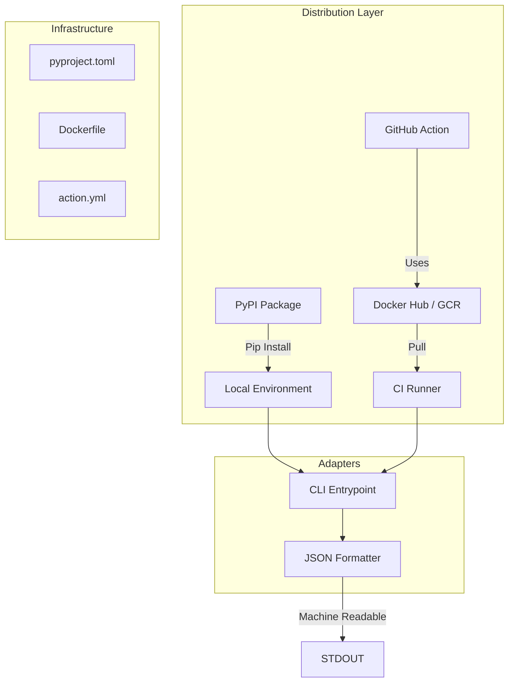

# Design Document: CI/CD Packaging & Actions


## Overview


This design focuses on transforming PyVisualGuard from a source-code-only project into a professional-grade tool ready for automated environments. The strategy centers on 'Distribution-as-Code,' where the packaging logic (PyPI), containerization (Docker), and workflow automation (GitHub Actions) are treated as first-class citizens. We move from manual script execution to a standardized CLI interface that serves both human developers and automated pipelines.

The core logic of the scanner remains untouched; instead, we build a robust 'adapter shell' around it. This includes a new structured logging system to support machine-readable formats like JSON, and a multi-stage Docker build to provide a slim, high-performance base image. This incremental approach ensures that while the delivery method changes, the security analysis remains consistent across all platforms.


## Architecture





## Components and Interfaces


### 1. Package Manifest (`infrastructure`)


**Path:** `pyproject.toml`

| Responsibility | Description |
|---|---|
| Define package metadata and versioning strategy | |
| Manage runtime and build-time dependencies | |
| Expose the CLI entry point for terminal access | |


```python
[project]
name = "pyvisualguard"
dependencies = ["pillow", "click", "pydantic"]

[project.scripts]
pyvisualguard = "pyvisualguard.adapters.cli:main"

[tool.hatch.build.targets.wheel]
packages = ["src/pyvisualguard"]
```


### 2. Slim CI Image (`infrastructure`)


**Path:** `Dockerfile`

| Responsibility | Description |
|---|---|
| Provide a reproducible execution environment | |
| Minimize image size for fast pull times in CI pipelines | |
| Bundle all necessary OS-level dependencies for image processing | |


```python
FROM python:3.11-slim as builder
RUN pip install --no-cache-dir build
COPY . /app
RUN python -m build

FROM python:3.11-slim
COPY --from=builder /app/dist/*.whl .
RUN pip install *.whl && rm *.whl
ENTRYPOINT ["pyvisualguard"]
```


### 3. GitHub Action Wrapper (`adapters`)


**Path:** `action.yml`

| Responsibility | Description |
|---|---|
| Enable seamless GitHub Workflow integration | |
| Map Action inputs to CLI arguments | |
| Provide standardized exit codes for CI gatekeeping | |


```python
name: 'PyVisualGuard Security Scan'
inputs:
  path:
    description: 'Path to images'
    required: true
outputs:
  results:
    description: 'Scanning results in JSON'
runs:
  using: 'docker'
  image: 'docker://ghcr.io/org/pyvisualguard:latest'
  args:
    - --path
    - ${{ inputs.path }}
    - --format
    - json
```


### 4. Structured Log Formatter (`adapters`)


**Path:** `src/pyvisualguard/adapters/formatters.py`

| Responsibility | Description |
|---|---|
| Serialize scan results into JSON format | |
| Maintain schema consistency for external tools | |
| Handle standard output redirection for log capture | |


```python
class JSONFormatter:
    def format(self, results: List[ScanResult]) -> str:
        return json.dumps([r.dict() for r in results], indent=2)

def main(format: str):
    if format == "json":
        print(JSONFormatter().format(results))
```


## Data Models


No new data models are introduced unless specified in the component descriptions above.


## Correctness Properties


*A property is a characteristic or behavior that should hold true across all valid executions of a system — essentially, a formal statement about what the system should do.*


### Property F6-P1: Reliable Gatekeeping Exit Codes


*For any execution of the 'pyvisualguard' command via the PyPI-installed package, the exit code must be 1 if and only if a critical vulnerability is detected, and 0 otherwise.*

**Validates: Requirements 3**


### Property F6-P2: Structured Output Verifiability


*For any scan execution where the '--format json' flag is provided, the resulting output must parse as a valid JSON array matching the established ScanResult schema.*

**Validates: Requirements 4**


### Property F6-P3: Image Size Constraint


*For any build of the official Docker image, the total compressed image size must remain below 150MB.*

**Validates: Requirements 2**


## Error Handling


| Scenario | Handling |
|---|---|
| Missing configuration file in GitHub Action run | The CLI catches the error, prints a JSON-formatted error object to stderr, and exits with a non-zero code to fail the CI step locally. |
| CI Runner times out or cancels the job | The Docker ENTRYPOINT handles signal propagation (SIGINT/SIGTERM) to ensure the container terminates cleanly without leaving orphaned processes in the runner. |


## Testing Strategy


The testing strategy for F6 emphasizes deployment-parity and integration. 

Regression testing will involve running the existing test suite against the built wheel and within the Docker container to ensure that packaging hasn't introduced environment-specific regressions. 

For CI verification, we will use a 'Test-on-Test' approach: a meta-workflow will trigger the GitHub Action on a repository containing known visual vulnerabilities (the 'sacrificial repo') and verify that it correctly identifies them and fails the build.

New property-based tests using 'Hypothesis' will focus on CLI argument parsing and Log Formatting. Specifically:
1. Verify that for any combination of valid CLI flags, the tool does not crash.
2. Verify that the JSON output always matches the ScanResult schema regardless of the number of findings.

The testing configuration will use 'Pytest' with a 'integration' tag. CI iterations will run on Ubuntu and macOS runners to ensure cross-platform wheel compatibility. Packaging artifacts (Wheels and Docker layers) will be scanned for vulnerabilities before final release using Trivy.
