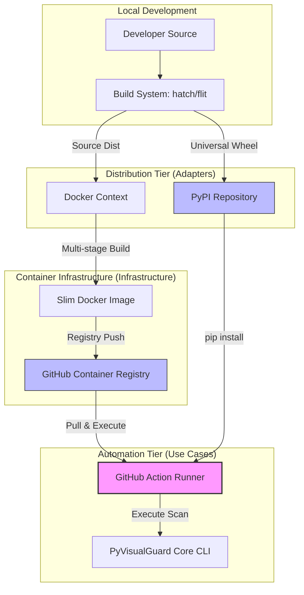

# Design Document: CI/CD Packaging & Actions


## Overview


The design for F6 adopts a 'Single Source of Packaging' philosophy, where the Python 'pyproject.toml' serves as the anchor for all distribution artifacts. We are shifting from a repository-as-a-tool model to a professional distribution model. This involves introducing standardized build backends (Hatchling) and creating tiered artifacts: a PyPI wheel for standard installation, a slim Docker image for containerized execution, and a GitHub Action for seamless CI integration.

Crucially, the core application logic (domain and usecases) remains untouched. The changes are strictly in the infrastructure and adapter layers. We use a multi-stage Docker build strategy to ensure that the image provided to DevOps leads is as small as possible, stripping away all build-time dependencies like compilers and source files, leaving only the operational runtime. This ensures high performance in automated environments where container pull times are a bottleneck.


## Architecture





## Components and Interfaces


### 1. Python Distribution Package (`infrastructure`)


**Path:** `pyproject.toml`

| Responsibility | Description |
|---|---|
| Define build-time dependencies and metadata | |
| Expose the CLI entry point globally as 'pyvisualguard' | |
| Specify versioning constraints for runtime dependencies | |


```python
[build-system]
requires = ["hatchling"]
build-backend = "hatchling.build"

[project]
name = "pyvisualguard"
dynamic = ["version"]
dependencies = ["pydantic>=2.0", "click>=8.0"]

[project.scripts]
pyvisualguard = "pyvisualguard.adapters.cli:main"
```


### 2. CI-Ready Slim Container Image (`infrastructure`)


**Path:** `Dockerfile`

| Responsibility | Description |
|---|---|
| Provide a reproducible execution environment for CI runners | |
| Minimize image size to reduce 'cold start' latency in pipelines | |
| Bundle security patches at the OS level during image builds | |


```python
FROM python:3.11-slim as builder
COPY . /app
RUN pip wheel --no-cache-dir --wheel-dir /wheels /app

FROM python:3.11-slim
COPY --from=builder /wheels /wheels
RUN pip install --no-index --find-links=/wheels pyvisualguard
ENTRYPOINT ["pyvisualguard"]
```


### 3. GitHub Action Wrapper (`usecases`)


**Path:** `action.yml`

| Responsibility | Description |
|---|---|
| Map GitHub Action inputs to CLI arguments | |
| Manage exit codes to signal pipeline success or failure | |
| Handle environment variable injection for sensitive scans | |


```python
name: 'PyVisualGuard Scanner'
inputs:
  path:
    description: 'Path to scan'
    required: true
    default: '.'
  fail-on-critical:
    description: 'Block pipeline on critical findings'
    default: 'true'
runs:
  using: 'docker'
  image: 'docker://ghcr.io/pyvisualguard/scanner:latest'
  args:
    - '--path'
    - ${{ inputs.path }}
    - '--fail'
    - ${{ inputs.fail-on-critical }}
```


## Data Models


No new data models are introduced unless specified in the component descriptions above.


## Correctness Properties


*A property is a characteristic or behavior that should hold true across all valid executions of a system — essentially, a formal statement about what the system should do.*


### Property F6-P1: Package Executability Invariant


*For any successful build of the Python package, the 'pyvisualguard' command must be executable in a clean virtual environment containing only declared dependencies.*

**Validates: Requirements 1**


### Property F6-P2: Minimal Image Footprint Property


*For any production Docker image build, the final image size must be less than 150MB and contain no development toolchains (e.g., gcc, git).*

**Validates: Requirements 2**


### Property F6-P3: Quality Gate Enforcement


*For any GitHub Action execution against a repository containing a critical vulnerability, the action must return a non-zero exit code if 'fail-on-critical' is true.*

**Validates: Requirements 3**


## Error Handling


| Scenario | Handling |
|---|---|
| CI Runner times out or is canceled by user | The CLI wrapper in the Docker image catches SIGTERM and ensures a JSON report is flushed to the output volume before exiting. |
| Invalid input path in Action YAML | The GitHub Action fails early with a descriptive error if the 'path' input points to a non-existent directory. |
| Registry downtime during Action execution | Fallback to standard pip installation if the pre-built Docker image is unreachable from the CI environment. |


## Testing Strategy


The testing strategy focuses on 'Distribution Integrity Verification'. 

1. Regression Testing: Existing core logic tests will be executed within the newly defined 'nox' sessions to ensure that the packaging process (like moving files into a 'src' layout) hasn't broken imports.
2. CI Verification: We will use GitHub Actions to test the GitHub Action. A 'canary' workflow will run on every PR to verify that the Docker image builds, and the Action correctly identifies a known local vulnerability.
3. Property-Based Testing: Using 'Hypothesis', we will test the CLI argument parser to ensure that any combination of flags (e.g., --fail, --json, --path) provided via the GitHub Action inputs results in a deterministic exit code and doesn't cause a crash.
4. Testing Configuration: We will use 'pytest-container' to verify the Docker image's behavior. Iterations: 50 per CLI flag permutation. Tags: 'dist', 'container', 'ci'. CI commands will include 'twine check' for PyPI metadata validaton.
