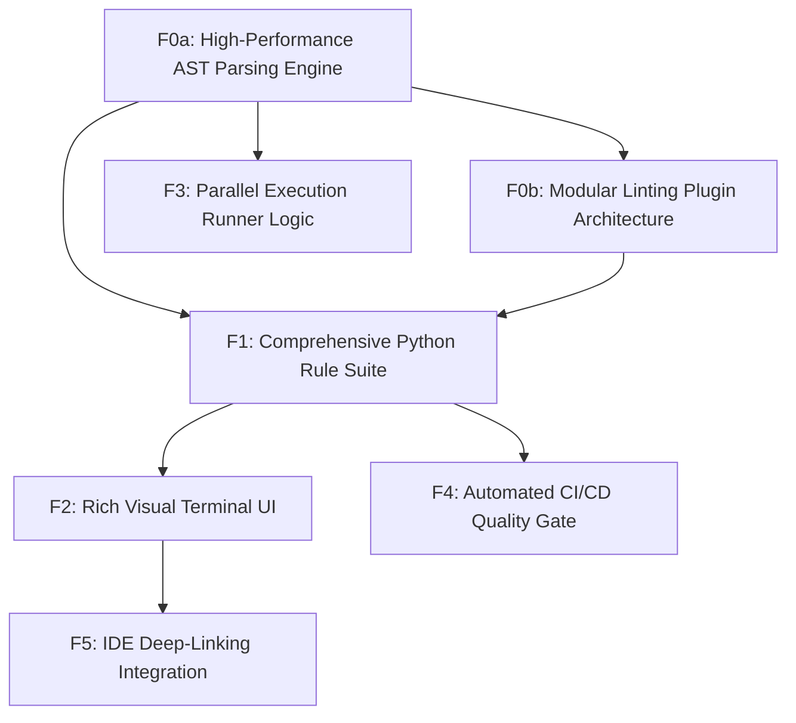

# Feature Map

## Features

| ID | Name | Type | Size | Dependencies |
|----|------|------|------|--------------|
| F0a | High-Performance AST Parsing Engine | foundation | large | — |
| F0b | Modular Linting Plugin Architecture | foundation | medium | F0a |
| F1 | Comprehensive Python Rule Suite | product | large | F0a, F0b |
| F2 | Rich Visual Terminal UI | product | medium | F1 |
| F3 | Parallel Execution Runner Logic | product | medium | F0a |
| F4 | Automated CI/CD Quality Gate | product | small | F1 |
| F5 | IDE Deep-Linking Integration | product | small | F2 |

## Milestones

### M0: Analytic Foundations

**Goal:** Build the core analysis infrastructure and plugin system.

**Exit Criteria:**
- Standard library AST parsing benchamrks met
- Successful plugin registration and execution of a dummy rule

**Features:** F0a, F0b

### M1: Visual Performance Release

**Goal:** Deliver high-performance linting with rich visual feedback.

**Exit Criteria:**
- Terminal output displays color-coded error tables and code snippets
- Support for multiple processes verified on 10k+ LoC repo

**Features:** F1, F2, F3

### M2: Workflow Integration

**Goal:** Integrate with professional developer workflows and CI/CD pipelines.

**Exit Criteria:**
- Exit codes correctly indicate failure in GitHub Actions or GitLab CI
- Clickable terminal links open files at specific lines in VS Code/PyCharm

**Features:** F4, F5

## Dependency Graph

