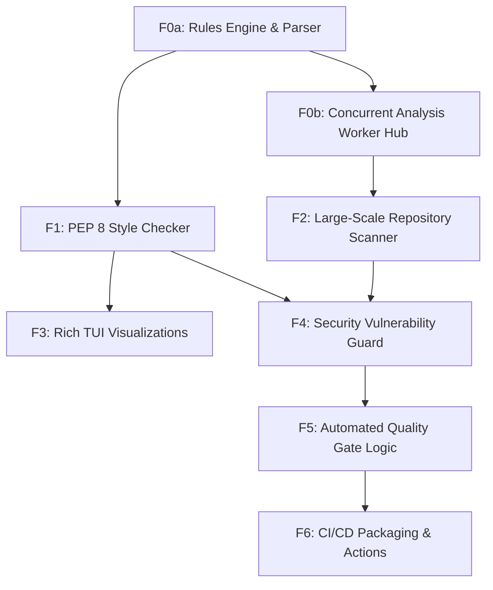

# Feature Map

## Features

| ID | Name | Type | Size | Dependencies |
|----|------|------|------|--------------|
| F0a | Rules Engine & Parser | foundation | large | — |
| F0b | Concurrent Analysis Worker Hub | foundation | medium | F0a |
| F1 | PEP 8 Style Checker | product | medium | F0a |
| F2 | Large-Scale Repository Scanner | product | large | F0b |
| F3 | Rich TUI Visualizations | product | large | F1 |
| F4 | Security Vulnerability Guard | product | medium | F1, F2 |
| F5 | Automated Quality Gate Logic | product | small | F4 |
| F6 | CI/CD Packaging & Actions | product | medium | F5 |

## Milestones

### M0: Core Engine Foundation

**Goal:** Build the high-performance core engine and analysis framework.

**Exit Criteria:**
- Rules engine passes 100+ unit tests on sample PEP 8 violations
- Parallel worker can process 1000 files in under 10 seconds

**Features:** F0a, F0b

### M1: The Visual Linter

**Goal:** Deliver the visual terminal experience and standard linting capabilities.

**Exit Criteria:**
- Rich TUI displays color-coded code blocks for detected errors
- CLI returns non-zero exit codes on security violations

**Features:** F1, F2, F3, F4

### M2: Scale & CI/CD Integration

**Goal:** Enable enterprise-scale CI/CD integration and deployment.

**Exit Criteria:**
- GitHub Action successfully blocks a PR with a simulated security vulnerability
- Docker image size is under 200MB and contains all dependencies

**Features:** F5, F6

## Dependency Graph

