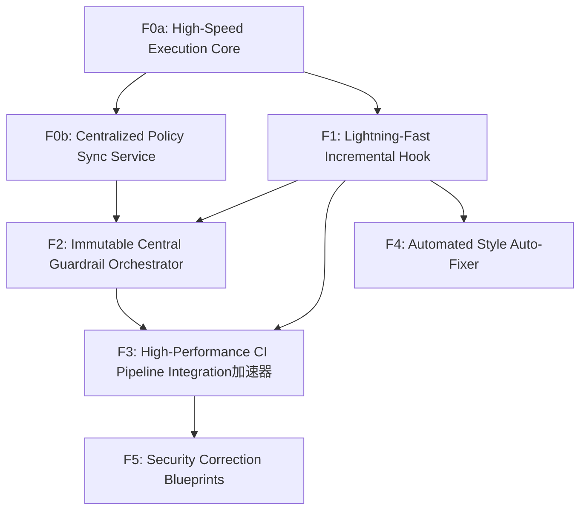

# Feature Map

## Features

| ID | Name | Type | Size | Dependencies |
|----|------|------|------|--------------|
| F0a | High-Speed Execution Core | foundation | large | — |
| F0b | Centralized Policy Sync Service | foundation | medium | F0a |
| F1 | Lightning-Fast Incremental Hook | product | medium | F0a |
| F2 | Immutable Central Guardrail Orchestrator | product | large | F0b, F1 |
| F3 | High-Performance CI Pipeline Integration加速器 | product | medium | F1, F2 |
| F4 | Automated Style Auto-Fixer | product | small | F1 |
| F5 | Security Correction Blueprints | product | small | F3 |

## Milestones

### M0Anchor: Foundation & Policy Core

**Goal:** Establish the core engine and policy distribution mechanics.

**Exit Criteria:**
- Execution core benchmarks outperform standard Flake8/Pylint by 5x on large repos.
- Policy sync successfully retrieves and validates YAML-based rules from a central source.

**Features:** F0a, F0b

### M1Delivery: Developer Velocity & Governance

**Goal:** Deliver developer tools and architect governance capabilities.

**Exit Criteria:**
- Incremental scanning reduces local check time to <1s for small diffs.
- Security guardrails cannot be overridden by local .flake8 or pyproject.toml files.
- CI/CD pipeline step reports 100% parity across multiple test repositories.

**Features:** F1, F2, F3, F4, F5

## Dependency Graph

